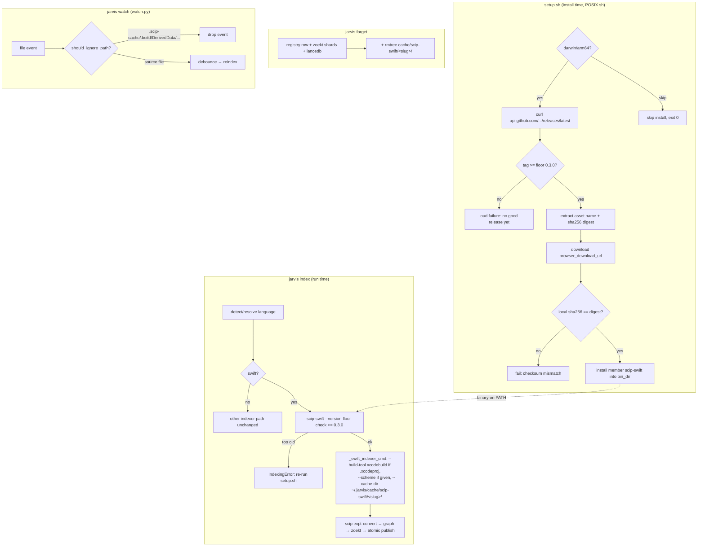

# Phase 2: scip-swift Toolchain Update - Research

**Researched:** 2026-08-22
**Domain:** Release-toolchain integration (setup.sh install + checksum, indexer argv contract, out-of-repo cache, watch self-trigger prevention)
**Confidence:** HIGH

<user_constraints>
## User Constraints (from CONTEXT.md)

### Locked Decisions
- **D-01:** setup.sh resolves the **latest scip-swift release at install time** (gh api / redirect), NOT a hand-locked exact tag — user's explicit choice against the exact-tag pattern used for SCIP/zoekt. Deviates from ROADMAP wording "fixed release"; intent (a working binary) preserved via D-02 — **Reversibility:** costly — switching back to an exact-tag pin later rewrites the setup.sh resolution block and its smoke-CI guard
- **D-02:** Latest-resolution is guarded by a **minimum-version floor** (e.g. `> v0.2.1`): resolved latest below the floor = loud setup failure stating no good release exists yet. This is what keeps auto-roll off the broken v0.2.0/v0.2.1 releases — **Reversibility:** costly — the floor constant is load-bearing for install correctness on every future release
- **D-03:** **Cutting the release is in-scope work for this phase** — tag scip-swift main, publish release assets + `.sha256` sidecars. The external gate resolves on our schedule; the floor is set to the tag we cut
- **D-04:** `jarvis index` adds a **runtime scip-swift version floor check** (mirroring `MIN_SCIP_VERSION` for `scip`): too-old binary fails loudly with a re-run-setup.sh recovery hint. Necessary because installs now auto-roll; pairs with Phase 1's failure reporting for the error payload
- **D-05:** scip-swift `--cache-dir` points at a **per-repo keyed** `~/.jarvis/cache/scip-swift/<slug>/` — deterministic isolation, no cross-repo IndexStore interference, clean lifecycle ownership
- **D-06:** `jarvis forget <slug>` **also deletes** that repo's cache dir — forgetting a repo removes everything jarvis stored for it
- **D-07:** Swift artifact ignores are added to the **existing ignore logic in `watch.py`** (`should_ignore_path()` + its ignore lists) — single ignore path for all languages, covered by the existing pure/fake-clock unit-test harness
- **D-08:** The ignore list is **broad — directory names AND suffix patterns, wherever they appear**: `.scip-cache`, `.build`, `DerivedData`, `.index-store`, `IndexStore`, `.swiftpm` build outputs. Belt-and-suspenders: the cache now lives outside the repo, but xcodebuild/SwiftPM configs can still drop artifacts in-tree
- **D-09:** `_swift_indexer_cmd` compatibility is proven by **CI smoke only** — extend `.github/workflows/setup-smoke.yml` with a post-install `jarvis index` run on a Swift fixture. No local integration test (user's explicit choice against the fixture-integration-test pattern)
- **D-10:** The CI smoke indexes a **new small `.xcodeproj` fixture under `tests/fixtures/`** — it must exercise `_prefers_xcodebuild()` → `--build-tool xcodebuild` dispatch, which is precisely the v0.2.x regression; `mini_swift_repo` as-is would not. macOS runners have Xcode; non-macOS legs already skip Swift install

### Claude's Discretion
- Resolution mechanism details (gh api vs redirect fallback) and floor constant naming in setup.sh
- Exact fixture project contents (minimal .xcodeproj that xcodebuild can index on a GitHub macOS runner)
- Whether the version-floor check reuses a shared helper with the existing `scip` version gate
- Checksum sidecar handling details under latest-resolution (asset name discovery)

### Deferred Ideas (OUT OF SCOPE)
None — discussion stayed within phase scope.
</user_constraints>

<phase_requirements>
## Phase Requirements

| ID | Description | Research Support |
|----|-------------|------------------|
| SWFT-01 | scip-swift pin moves off v0.1.2 to a fixed release cut from main (v0.2.0/v0.2.1 carry an xcodebuild-dispatch regression); `_swift_indexer_cmd` compatibility verified against the pinned release | v0.3.0 (published 2026-08-18, Latest) contains the dispatch fix (commit `9bcf1688`, verified in-repo at tag + empirically: real xcodebuild dispatched, valid .scip, full `jarvis index` e2e green). No new release cut needed — D-03 contingency unused. Runtime floor check pattern verified against `MIN_SCIP_VERSION` gate |
| SWFT-02 | setup.sh handles the current release-asset naming; checksum verification retained | v0.3.0 asset naming verified live (`scip-swift-0.3.0.tar.gz`, single member `scip-swift`, universal binary). No `.sha256` sidecar exists — GitHub's API asset `digest` field verified empirically as a byte-exact server-side sha256; POSIX-sh extraction of tag/digest/URL validated against the live API |
| SWFT-03 | scip-swift cache lives outside repo trees (`--cache-dir` under `~/.jarvis`); watch never self-triggers on it | `--cache-dir` flag verified on the v0.3.0 binary; cache layout observed (`build-scratch/`, `index-db/`, `docs/`, `derived-data/`, `manifest.json`); upstream manifest auto-invalidates on version/toolchain change (no jarvis-side keying). Repo-tree pollution measured: only a one-time `xcshareddata/swiftpm/configuration` write |
</phase_requirements>

## Project Constraints (from CLAUDE.md / AGENTS.md)

- `setup.sh` is **strictly POSIX sh** — dash-tested by `tests/test_setup_sh.py` and the smoke CI's `sh -n setup.sh` parse gate. No bashisms, no `jq` dependency (verified: sed/grep extraction suffices against the live API).
- Conventional Commits (`feat(scope):`, `fix(scope):`, `test:`, `chore:`), lowercase imperative subjects.
- Python 3.12+, modern type-hint syntax (`str | None`, `list[T]`), frozen dataclasses, raw `sqlite3`, no new deps in this phase.
- Test files mirror source modules 1:1 (`test_setup_sh.py` ↔ setup.sh, `test_watch.py` ↔ watch.py, `test_index_cli.py` ↔ index_cli.py).
- Env-var overrides are `JARVIS_`-prefixed; existing test seams: `JARVIS_BIN_DIR`, `JARVIS_SETUP_SOURCED` (STACK.md §Configuration), `ZOEKT_BASE_URL` (setup.sh:507) — the pattern for the new API-URL test seam.
- `uv run pytest -m "not integration"` must stay green; integration tests skip cleanly when binaries are absent.
- Comments document *why*, not *what* (see the long rationale comments in `setup.sh` / `index_cli.py` — match that voice).

## Summary

The external gate this phase was planned around has **resolved itself**: upstream `jarvis-intelligence/scip-swift` published **v0.3.0 on 2026-08-18** (Latest as of 2026-08-22), and it contains the xcodebuild-dispatch fix — commit `9bcf168b` "feat(phase-6): restore xcodebuild dispatch on the temp-branch path" (plus test-first commits `e74d16bf`/`028c35a7` and the shared-dispatch-helper wiring `9200e701`), sitting between v0.2.1 and v0.3.0 in the compare range. **D-03's cut-a-release contingency is NOT needed**: main is exactly 1 commit ahead of v0.3.0 (a test-only commit for the next milestone). This was verified empirically, not just from commit messages: I downloaded the v0.3.0 tarball, ran the binary against upstream's own `Fixtures/XcodeTestProject`, watched a real ~26s xcodebuild build dispatch, and then ran **jarvis's current code end-to-end** (`jarvis index` on a git-init'd copy of that fixture) → `status: indexed`, `language: swift`, fully navigable index (not partial), exit 0.

The release contract changed in three ways jarvis must absorb (SWFT-02): asset naming went from `scip-swift-v0.1.2-macos-arm64.tar.gz` to `scip-swift-<version>.tar.gz` (no `v`, no platform suffix), the tarball is now a **universal binary** (x86_64+arm64, 10.8 MB vs 1.8 MB), and **no `.sha256` sidecar is published** — upstream's `release.yml` computes the digest but spends it only on the Homebrew tap formula. The recommended checksum answer is GitHub's REST-API **asset `digest` field** (official since 2025-06-03, "generated at upload time, immutable"): I verified byte-exactness by downloading the v0.3.0 asset and matching its local sha256 (`4b985b29…4e141`) against the API digest. The same single anonymous API call resolves latest tag + asset name + download URL + digest, which serves D-01 (latest-at-install), D-02 (floor), and SWFT-02 (checksum) in one fetch, with POSIX-sh extraction validated against the live response.

The cache story (SWFT-03/D-05) is cleaner than the CLI help suggests: `Sources/scip-swift/Commands/IndexCommand.swift:74` (read at tag v0.3.0) — `let persistentCache = cacheDir != nil || indexOnly` — means **without `--cache-dir` v0.3.0 uses a temp scratch dir and leaves NOTHING in the repo tree** (the documented `<repo>/.scip-cache/` default only materializes on `--index-only` runs). With `--cache-dir <path>`, everything (build scratch, index-db, docs, **derived-data**) lands under that path, and the upstream manifest auto-invalidates wholesale on converter/toolchain/symbolFormat/demangle changes — so jarvis needs no cache versioning, only the path plumbing and the `forget` sweep. Warm-cache reindex measured at **3.7s vs 13–26s cold**. Watch pollution is a non-issue in practice (only a one-time empty `xcshareddata/swiftpm/configuration` file inside `.xcodeproj`), so D-07/D-08's ignore additions are the belt-and-suspenders they were designed to be.

**Primary recommendation:** Resolve latest via one anonymous `curl api.github.com/repos/jarvis-intelligence/scip-swift/releases/latest` call (make the URL overridable like `ZOEKT_BASE_URL` for tests), floor at `>= 0.3.0`, verify the tarball against the API digest (no sidecar dependency — optionally patch upstream `release.yml` to publish sidecars going forward, but nothing in jarvis should wait on it), pass `--cache-dir "$(config.swift_cache_dir(slug))"` on every Swift index, mirror `check_scip_version()` for the runtime floor, extend `should_ignore_path()` per D-08, and derive the CI fixture from upstream's `Fixtures/XcodeTestProject` (proven to index green through jarvis's own argv).

## Architectural Responsibility Map

| Capability | Primary Tier | Secondary Tier | Rationale |
|------------|-------------|----------------|-----------|
| Latest-release resolution + floor + checksum | setup.sh (bootstrap, POSIX sh) | GitHub REST API (data source) | Install-time concern; must work pre-Python, in `curl \| sh`; API supplies tag+asset+digest in one call |
| Runtime version floor (D-04) | `index_cli.py` (application) | — | Mirrors `check_scip_version()`; must fire per-index for Swift repos only, with Phase-1 failure-reporting payload |
| `--cache-dir` argv plumbing | `index_cli.py` (`_swift_indexer_cmd`) | `config.py` (path helper) | argv construction already lives in `_swift_indexer_cmd`; path policy belongs with the other `~/.jarvis` layout helpers |
| Cache lifecycle (forget sweep, D-06) | `index_cli.py` (`_cmd_forget`) | `config.py` | Same place `lancedb_dir` is swept |
| Watch self-trigger prevention (D-07/08) | `watch.py` (`should_ignore_path`) | — | Pure function, existing fake-clock unit harness |
| CI smoke verification (D-09/10) | `.github/workflows/setup-smoke.yml` | `tests/fixtures/` | Only macOS runners have Xcode; unit CI cannot exercise the binary |
| Upstream release ops | jarvis-intelligence/scip-swift repo | — | **No operation needed this phase** (v0.3.0 suffices); optional sidecar patch is upstream-only |
| Binary platform gating | setup.sh (`install_scip_swift`) | — | Keeps darwin/arm64 gate (universal binary makes x86_64 *possible*, but relaxing the gate is outside D-01..D-10) |

## Standard Stack

No new libraries — this phase wires existing surfaces to a verified external binary. The "stack" is:

### Core
| Component | Version | Purpose | Why Standard |
|---------|---------|---------|--------------|
| scip-swift binary | **v0.3.0** (universal macOS binary; reports `0.3.0 (swift 6.2.4)`) | Swift SCIP indexer driven by `_swift_indexer_cmd` | First release with restored xcodebuild dispatch; Latest as of 2026-08-18 [VERIFIED: gh release list + local binary run] |
| GitHub Releases REST API | `/releases/latest` | Latest-tag resolution + asset name + sha256 `digest` | One anonymous call serves D-01+D-02+SWFT-02; digest official + immutable since 2025-06-03 [VERIFIED: API call + changelog + byte-exact hash match] |
| curl | already required by `download_to()` (setup.sh:250-252) | API fetch + asset download | No new dependency; `--retry 3` pattern exists |

### Supporting
| Component | Version | Purpose | When to Use |
|---------|---------|---------|-------------|
| upstream `Fixtures/XcodeTestProject` | v0.3.0 tag | Template for jarvis's D-10 `.xcodeproj` fixture | Proven end-to-end through jarvis's own argv this session |
| `install_tarball_binary` + `verify_sha256` (setup.sh:258/238) | current | Reuse for digest-verified install | Needs a digest-parameterized variant (sidecar-URL → expected-hash) |

### Alternatives Considered
| Instead of | Could Use | Tradeoff |
|------------|-----------|----------|
| API `digest` field for checksum | Re-publish `.sha256` sidecar on v0.3.0 (+ patch upstream release.yml) | Sidecar matches zoekt/scip pattern and ROADMAP's wording, but requires an upstream asset upload now and forever; API digest needs zero upstream ops and auto-exists for every future release [RECOMMENDED: API digest; sidecar optional belt-and-suspenders] |
| REST API for latest resolution | `curl -fsSI …/releases/latest` redirect (`Location: …/tag/v0.3.0`) | Redirect has no rate limit but returns only the tag — no digest, no asset name; would force constructing asset names and still needing a checksum source [VERIFIED both work; API preferred since it's needed for the digest anyway] |
| Floor `>= 0.3.0` | D-02's literal example `> v0.2.1` | Equivalent for every release that exists; `>= 0.3.0` is safer because a hypothetical v0.2.2 cut from the pre-fix branch would pass `> v0.2.1` while still being broken — the dispatch fix landed in 0.3.0 [RECOMMENDED: `>= 0.3.0`, inclusive-ge comparison] |

**Installation:** none (`uv sync` unchanged; no new Python deps).

**Version verification:** binary provenance verified this session —
- `gh release list`: v0.3.0 Latest, published 2026-08-18T09:35:08Z; v0.2.1 (2026-08-15) and v0.2.0 (2026-08-13) precede it; v0.1.2 (2026-08-08) is the current pin.
- Downloaded `scip-swift-0.3.0.tar.gz` (10,787,033 bytes), local `shasum -a 256` = `4b985b29f439cb2a9a04acc660c085ad9d736d149e795d70f264036a5314e141` = API `digest` field, byte-exact.

## Package Legitimacy Audit

No registry packages (npm/PyPI/crates) are installed by this phase. The one external artifact is the scip-swift release binary:

| Package | Registry | Age | Downloads | Source Repo | Verdict | Disposition |
|---------|----------|-----|-----------|-------------|---------|-------------|
| scip-swift v0.3.0 tarball | GitHub Releases (jarvis-intelligence/scip-swift) | 4 days | 2 (asset) | github.com/jarvis-intelligence/scip-swift (our org) | OK | Approved — provenance established by sha256 match against the API digest + end-to-end functional verification |

Low-download count is expected (private-ish org repo; the Homebrew tap is the consumer-facing channel). Tarball contains exactly one member, `scip-swift` (`tar -tzf` verified) — no archive-path traversal surface beyond the pinned member name.

## Architecture Patterns

### System Architecture Diagram



### Recommended Project Structure
```
setup.sh                                  # latest-resolution + floor + digest verify (install_scip_swift rewrite)
src/jarvis/config.py                      # + swift_cache_dir(slug) → data_dir/cache/scip-swift/<slug>
src/jarvis/index_cli.py                   # + MIN_SCIP_SWIFT_VERSION gate; --cache-dir in _swift_indexer_cmd; forget sweep
src/jarvis/watch.py                       # _IGNORED_PATH_PARTS += Swift artifact names
tests/fixtures/mini_xcode_repo/           # NEW: .xcodeproj fixture (derived from upstream XcodeTestProject)
tests/test_setup_sh.py                    # adapt pin/asset tests → resolution/floor/digest tests (+ API URL seam)
tests/test_index_cli.py                   # extend _swift_indexer_cmd argv tests; floor-check tests; forget sweep test
tests/test_watch.py                       # extend should_ignore_path tests
.github/workflows/setup-smoke.yml         # + post-install jarvis index on fixture (macOS leg)
```

### Pattern 1: Latest-resolution with floor + digest verification (setup.sh)
**What:** Replace the static pin with one API fetch; validate, floor-check, verify, install.
**When to use:** `install_scip_swift` rewrite (D-01/D-02/SWFT-02).
**Test seam (load-bearing):** make the API URL overridable exactly like `ZOEKT_BASE_URL` (setup.sh:507: `_base="${ZOEKT_BASE_URL:-https://github.com/...}"`) — e.g. `SCIP_SWIFT_API_URL` — so `tests/test_setup_sh.py` can serve local JSON via `run_func(..., env={...})` without network.
**Extraction (validated against the live API this session, POSIX-safe):**
```sh
# api.github.com returns pretty-printed JSON — line-oriented sed/grep extraction is sufficient.
_tag=$(sed -n 's/.*"tag_name": *"\([^"]*\)".*/\1/p' "$_json" | head -1)
_digest=$(grep -o '"digest": *"[^"]*"' "$_json" | head -1 | sed 's/.*"sha256:/sha256:/;s/"$//')
_url=$(grep -o '"browser_download_url": *"[^"]*\.tar\.gz"' "$_json" | head -1 | sed 's/.*"\(https[^"]*\)"/\1/')
```
[VERIFIED: run against `https://api.github.com/repos/jarvis-intelligence/scip-swift/releases/latest` — yielded `v0.3.0`, `sha256:4b985b29…`, and the correct download URL]
**Security:** validate the tag shape before use (`case $_tag in v[0-9]*.[0-9]*.[0-9]*) ;; *) fail ;; esac`) — the JSON is untrusted network input flowing into shell variables and a URL.

### Pattern 2: Version-floor gate mirroring `check_scip_version` (D-04)
**What:** Isolated output probe + tolerant parse + loud failure with recovery hint.
**When to use:** `index_cli.py`, called from `index_repo` only when the resolved language is `swift` (non-Swift repos and non-macOS hosts must not need the binary).
**Model (verbatim, src/jarvis/index_cli.py:380-389):**
```python
def parse_scip_version(output: str) -> tuple[int, int, int] | None:
    """Parse `scip --version` output, e.g. "scip version v0.9.0".

    Returns None when the format is unrecognized, so an unexpected build
    string degrades to "cannot verify" rather than blocking indexing.
    """
    match = re.search(r"v?(\d+)\.(\d+)\.(\d+)", output)
    if match is None:
        return None
    return (int(match.group(1)), int(match.group(2)), int(match.group(3)))
```
The regex already tolerates the no-`v` form: scip-swift v0.3.0 prints exactly `0.3.0 (swift 6.2.4)` to stdout, exit 0 [VERIFIED: local run]. A shared parse helper + separate `MIN_SCIP_SWIFT_VERSION = (0, 3, 0)` constant is the natural reuse (Claude's-discretion item); the `_scip_version_output()` monkeypatch-isolation pattern (index_cli.py:392-398) applies verbatim to a `_scip_swift_version_output()`.

### Pattern 3: Out-of-repo cache keyed per slug (D-05/D-06)
**What:** `config.swift_cache_dir(slug)` → `data_dir() / "cache" / "scip-swift" / slug`; inject `--cache-dir` on **every** Swift invocation (both swiftpm and xcodebuild paths); `forget` sweeps it with `shutil.rmtree(..., ignore_errors=True)` exactly like the lancedb line (index_cli.py:1117).
**Why safe without jarvis-side versioning — upstream manifest handles it (verbatim, Sources/scip-swift/Commands/IndexCommand.swift:125-133 read at tag v0.3.0):**
```swift
      if let manifest = store.loadManifest() {
        if !manifest.isCompatibleWith(
          toolchainVersion: ToolchainInfo.pinnedSwiftVersion,
          converterVersion: ScipSwiftVersion.version,
          indexstoreDbRevision: indexstoreDbRevision,
          buildToolName: tool.rawValue,
          symbolFormatVersion: SymbolFormatVersion.current,
          demangle: demangle
        ) {
          try store.invalidateAll()
```
A scip-swift auto-roll to a newer binary wholesale-invalidates the cache on the next run — jarvis never needs to key or version the cache directory.
**Observed cache layout** [VERIFIED: local run with `--cache-dir`]: `manifest.json`, `build-scratch/`, `index-db/`, `docs/`, `derived-data/` — note `derived-data` lives *inside* the cache dir, so D-05 also keeps xcodebuild's build products out of both the repo tree and `~/Library/Developer/Xcode/DerivedData` for the build itself.

### Pattern 4: D-10 fixture derived from upstream XcodeTestProject
**What:** Copy/adapt upstream `Fixtures/XcodeTestProject` (v0.3.0 tag) into `tests/fixtures/` under a jarvis name: `scip-swift-test.xcodeproj/project.pbxproj` (9,095 bytes) + `project.xcworkspace/contents.xcworkspacedata` (135 bytes, the standard self-referencing workspace) + `scip-swift-test/SwiftFile.swift` (517 bytes, Animal/Dog class hierarchy with `@main`).
**Why it works:** single `com.apple.product-type.tool` target (no signing, no provisioning — matches the v0.1.2 rationale comment at setup.sh:45-47), one auto-resolvable scheme, `objectVersion = 77` / `compatibilityVersion = "Xcode 14.0"`, builds green on local Xcode 26.3 in ~13-26s cold / 3.7s warm. **Proven through jarvis itself** this session: git-init'd copy → `jarvis index` → `status: indexed`, `language: swift` — i.e. `_prefers_xcodebuild()` fired, `--build-tool xcodebuild` dispatched, and `index_has_navigation_data()` found real positions (status was `indexed`, not `partial`).
**CI note:** fixture must remain git-tracked (language detection reads `git ls-files`); smoke step needs `RUNNER_TEMP/ci-bin` on PATH plus `JARVIS_DATA_DIR` pointed at a temp dir so the runner's `~/.jarvis` isn't touched.

### Anti-Patterns to Avoid
- **Constructing the asset URL from the tag** (`scip-swift-${VERSION}.tar.gz` by string surgery): the naming convention already changed once (v0.1.2 → v0.2.0); the API hands you `browser_download_url` — use it.
- **Sidecar-URL probing with fallback to digest**: two checksum sources means two code paths; pick the API digest (present for every release, past and future — even v0.1.2 has one).
- **Creating the cache dir from jarvis**: upstream creates it (`FileManager.default.createDirectory(atPath: resolvedCacheDir, withIntermediateDirectories: true)`, IndexCommand.swift:83); jarvis only computes the path.
- **Gating the whole install behind the API call**: keep the `darwin/arm64` skip check FIRST (current order, setup.sh:555-558) so Linux CI legs exit 0 without touching the network.
- **Bare `already_installed` skip under auto-roll**: presence-gating strands every v0.1.2 install forever (the exact bug the scip installer's version-gate comment warns about, setup.sh:452-460). Skip only when the installed binary's `--version` already satisfies the resolved version — mirror `installed_scip_matches_pin` (setup.sh:438-446).

## Don't Hand-Roll

| Problem | Don't Build | Use Instead | Why |
|---------|-------------|-------------|-----|
| Checksum source of truth | Sidecar files we must publish+maintain | GitHub API `digest` field | Official, immutable, computed at upload, backfilled on old releases [VERIFIED: changelog + byte-exact match] |
| Latest-release resolution | HTML scraping or release-page parsing | `releases/latest` API (or redirect) | Documented, stable, excludes prereleases/drafts [CITED: docs.github.com rest/releases] |
| Cache invalidation on binary upgrade | Manifest keys in the cache dir name or a jarvis-side version file | Upstream `IndexManifest.isCompatibleWith` | Already keys on toolchain+converter+indexstoredb-rev+buildtool+symbolformat+demangle (IndexCommand.swift:125-143) |
| Semver comparison in POSIX sh | `sort -V` (GNU-only, absent on macOS/BSD) | IFS/cut numeric field compare | Verified dash+sh-safe snippet below |
| The `.xcodeproj` fixture | Generating pbxproj from scratch | Adapt upstream's committed fixture | Proven buildable + indexable through jarvis this session |

**Key insight:** every hard part of this phase (dispatch correctness, cache relocation, invalidation, fixture validity) is already solved upstream or by platform features; jarvis's job is argv/path plumbing plus install-time resolution.

## Runtime State Inventory

> Phase type: toolchain migration (v0.1.2 → v0.3.0 + cache relocation). Inventory completed.

| Category | Items Found | Action Required |
|----------|-------------|------------------|
| Stored data | `~/.jarvis/registry.db` rows for Swift repos indexed under v0.1.2 (none on this dev machine: `~/.jarvis/bin` has no scip-swift binary — checked) | None — reindex rebuilds; old indexes stay valid until then |
| Live service config | Homebrew tap `phuongddx/homebrew-scip-swift` formula auto-updates on upstream tags (release.yml sed-rewrites it) — unaffected by jarvis changes | None |
| OS-registered state | None — setup.sh only appends bin_dir to shell rc PATH; no launchd/pm2/services involved | None — verified by reading setup.sh ensure_on_path (setup.sh:177-204) |
| Secrets/env vars | No new secrets. New optional env seam `SCIP_SWIFT_API_URL` (test override, `ZOEKT_BASE_URL` pattern); `JARVIS_DATA_DIR` already exists for cache relocation tests | None — additive |
| Build artifacts | Existing installs may hold `scip-swift` v0.1.2 in bin_dir (auto-roll upgrade handles it once the skip-gate is version-aware); stray `~/Library/Developer/Xcode/DerivedData/scip-swift-test-*` dirs on dev machines are xcodebuild Logs-only bookkeeping (~20 KB each, outside repo trees) | Version-aware skip-gate (code edit); no data migration |

**Nothing found in category** — explicitly: no `.scip-cache` directories exist anywhere yet (v0.1.2 lacks the feature — verified: current `install_scip_swift` invokes no cache flag and v0.1.2 predates the incremental layer that landed in v0.2.0's phase-3).

## Common Pitfalls

### Pitfall 1: Trusting the CLI help over the code for `.scip-cache` default
**What goes wrong:** Assuming scip-swift pollutes `<repo>/.scip-cache/` by default and designing watch-ignores/tests around that assumption.
**Why it happens:** `--cache-dir`'s help text says "Defaults to `<repo>/.scip-cache/`" — but `IndexCommand.swift:74` reads `let persistentCache = cacheDir != nil || indexOnly`; the default value only takes effect on `--index-only` runs, which jarvis never issues.
**How to avoid:** jarvis always passes `--cache-dir`; treat in-tree `.scip-cache` as a third-party/manual-run phenomenon (which is exactly D-08's belt-and-suspenders framing).
**Warning signs:** tests asserting `.scip-cache` appears in-tree after a jarvis run (it won't, on v0.3.0, either path).

### Pitfall 2: Presence-gated skip strands v0.1.2 installs
**What goes wrong:** Reusing `already_installed scip-swift` unchanged — every existing install silently stays on the broken-for-this-milestone v0.1.2 (or worse, a hypothetical v0.2.x) forever.
**Why it happens:** The current gate (setup.sh:560-563) predates auto-roll.
**How to avoid:** Compare installed `scip-swift --version` against the resolved latest before skipping (the `installed_scip_matches_pin` pattern, setup.sh:438-446); also keep the scip installer's PATH-shadowing warning in mind (setup.sh:468-475) — a stale scip-swift earlier on PATH keeps winning.
**Warning signs:** re-running setup.sh prints "already installed" on a machine holding v0.1.2.

### Pitfall 3: Shell-injection via API JSON
**What goes wrong:** `tag_name`/`digest`/URL extracted from network JSON flow unquoted (or unvalidated) into URLs, `case` patterns, or `echo`.
**Why it happens:** The API response is untrusted input; a compromised or proxied response can carry shell metacharacters.
**How to avoid:** Validate tag shape (`v<digits>.<digits>.<digits>`) and digest shape (`sha256:[0-9a-f]{64}`) before use; double-quote every expansion; pin the tar member name as the literal `scip-swift` rather than a JSON-derived value.
**Warning signs:** any `eval`, unquoted interpolation into `curl` URLs, or member names taken from the API.

### Pitfall 4: API rate limiting in CI
**What goes wrong:** Anonymous core limit is 60 req/hr/IP; a busy shared CI IP can exhaust it, failing installs with HTTP 403.
**Why it happens:** `api.github.com` unauthenticated quota.
**How to avoid:** One API call per setup run (resolution+digest in the same fetch); fail loudly with the HTTP status so the cause is legible. Optionally fall back to the redirect mechanism (no rate limit) for tag resolution — but the digest still needs the API, so a redirect-only fallback cannot verify checksums; simpler to fail loudly.
**Warning signs:** smoke CI flaking with 403s from api.github.com.

### Pitfall 5: Floor semantics off-by-one
**What goes wrong:** Implementing D-02's example `> v0.2.1` literally would admit a hypothetical v0.2.2 cut from the pre-fix branch (broken dispatch, still 0.2.x).
**Why it happens:** The fix landed specifically in 0.3.0 (`9bcf1688`); "newer than the last broken release" ≠ "contains the fix".
**How to avoid:** Floor at `>= 0.3.0` (inclusive). D-02's locked intent is "keeps auto-roll off the broken v0.2.0/v0.2.1 releases" — an inclusive 0.3.0 floor satisfies it strictly better.
**Warning signs:** a floor constant expressed as a not-equal/exclude-list instead of a minimum.

### Pitfall 6: Forgetting the `--version` format difference
**What goes wrong:** Floor parser expects a `v` prefix; scip-swift prints `0.3.0 (swift 6.2.4)` — no `v`.
**Why it happens:** scip prints `scip version v0.9.0`; scip-swift's format differs.
**How to avoid:** The existing `parse_scip_version` regex `r"v?(\d+)\.(\d+)\.(\d+)"` already makes the `v` optional — reuse it rather than writing a new parser.
**Warning signs:** floor check treating v0.3.0 as unparseable and warn-by-omission-ing every install.

### Pitfall 7: One-shot `xcshareddata` write under watch
**What goes wrong:** xcodebuild creates `scip-swift-test.xcodeproj/project.xcworkspace/xcshareddata/swiftpm/configuration` (observed; empty file) inside the repo on first build — a watch loop sees the create event.
**Why it happens:** xcodebuild writes default SwiftPM config when none exists.
**How to avoid:** Accept it (one extra debounced reindex on first index only — the file is not rewritten on later runs; not a treadmill), or add `xcshareddata` to the ignore list per D-08's spirit. Either is defensible; document the choice. Do NOT ignore `.xcodeproj` wholesale — `project.pbxproj` edits are legitimate reindex triggers.
**Warning signs:** a watch-treadmill test that flakes on the first event burst only.

## Code Examples

### POSIX-sh version-floor compare (verified under `/bin/sh` and `/bin/dash` this session)
```sh
# Source: verified 2026-08-22 by running under sh(=bash posix-mode) and dash:
#   0.3.0 vs 0.3.0 -> GE ; v0.3.0 vs 0.2.1 -> GE ; v0.2.2 vs 0.3.0 -> LT ; v0.10.0 vs 0.3.0 -> GE
# Numeric field compare, NOT lexicographic (0.10.0 > 0.3.0 must be GE).
version_ge() {
	_v1=$(printf '%s' "$1" | tr -d 'v'); _v2=$(printf '%s' "$2" | tr -d 'v')
	_i=1
	while [ $_i -le 3 ]; do
		_a=$(printf '%s' "$_v1" | cut -d. -f$_i); _b=$(printf '%s' "$_v2" | cut -d. -f$_i)
		[ -z "$_a" ] && _a=0; [ -z "$_b" ] && _b=0
		[ "$_a" -gt "$_b" ] && return 0
		[ "$_a" -lt "$_b" ] && return 1
		_i=$((_i + 1))
	done
	return 0
}
```

### Digest-verified install (adapts `install_tarball_binary`, setup.sh:258-304)
```sh
# Existing helper takes a sidecar URL; the digest route passes the expected
# hash directly — only the "download sidecar + cut -d' ' -f1" block
# (setup.sh:276-284) is replaced by the caller supplying $_expected.
# verify_sha256 (setup.sh:238-248) and the tar-extract/member-install tail
# are reused unchanged.
```

### Runtime floor gate (Python side, mirroring index_cli.py:401-415)
```python
MIN_SCIP_SWIFT_VERSION = (0, 3, 0)

def check_scip_swift_version() -> None:
    version = parse_scip_version(_scip_swift_version_output())
    if version is None:
        return  # unknown format: warn-by-omission, same policy as check_scip_version
    if version < MIN_SCIP_SWIFT_VERSION:
        ...  # IndexingError naming the floor and "re-run setup.sh"
```
Call site: inside `index_repo` after language resolution, guarded by `if language == "swift"` — NOT unconditionally like `check_scip_version()` (index_cli.py:770), because non-macOS hosts legitimately never install scip-swift.

### Watch ignore extension (watch.py:18-24 verbatim today)
```python
_IGNORED_PATH_PARTS = {".git", "node_modules", ".venv", "__pycache__", "dist", "build"}


def should_ignore_path(path: str) -> bool:
    """True if any path component is a vendor/VCS directory this watcher
    should never trigger a reindex for."""
    return any(part in _IGNORED_PATH_PARTS for part in path.split("/"))
```
D-08 additions are component names — note `build` (no dot) is already covered; `.build` (SwiftPM's) is distinct and must be added separately: `.scip-cache`, `.build`, `DerivedData`, `.index-store`, `IndexStore`, `.swiftpm`. If suffix matching is also wanted (D-08 says "directory names AND suffix patterns"), it is a matcher extension, not a data change — current matcher is components-only.

## State of the Art

| Old Approach | Current Approach | When Changed | Impact |
|--------------|------------------|--------------|--------|
| scip-swift v0.1.2, arm64-only asset, `scip-swift-v0.1.2-macos-arm64.tar.gz` + `.sha256` sidecar | v0.3.0, universal binary, `scip-swift-<ver>.tar.gz`, no sidecar (digest via API) | v0.2.0 (2026-08-13) renamed assets; v0.3.0 (2026-08-18) fixed dispatch | setup.sh asset-name + checksum logic must switch to discovery+digest |
| `--build-tool xcodebuild` silently ignored (v0.2.x dispatch loss in `indexOneRepo` extraction) | Restored via shared `produceIndexStore(tool:)` helper switching on BuildTool | v0.3.0 commit `9bcf1688` | `_swift_indexer_cmd`'s core contract works again — verified end-to-end |
| No incremental cache (v0.1.x) | `--cache-dir` persistent cache with manifest auto-invalidation; temp-scratch when absent | v0.2.0 (INCR-01..06), normalized absolute paths in v0.3.0 (`1f599915`, G-v030-1) | D-05 plumbing is pure gain; measured 3.7s warm vs 13-26s cold |

**Deprecated/outdated:**
- ROADMAP's "restored `.sha256` sidecars" upstream note: superseded by the API-digest route (CONTEXT grants discretion on "checksum sidecar handling details"); a sidecar backfill on v0.3.0 is *optional* belt-and-suspenders, not a dependency.
- ROADMAP's plan-time contingency ("hold Phase 2 / stay on v0.1.2"): obsolete — the gate resolved.

## Assumptions Log

| # | Claim | Section | Risk if Wrong |
|---|-------|---------|---------------|
| A1 | GitHub `macos-latest` runners are arm64 with full Xcode + `xcodebuild` on PATH (repo's own setup-smoke.yml comment asserts "macOS runners are arm64 and download for real"; not exercised live this session) | D-09/D-10, Environment | Smoke CI step fails → would need `macos-15` explicit pin or Xcode setup action; low likelihood |
| A2 | `releases/latest` continues to exclude prereleases/drafts and reflect the Latest badge (documented REST behavior; verified live for this repo today) | Pattern 1 | A future prerelease marked Latest could resolve as install target — the floor would still catch version regressions but not pre-release instability; low |
| A3 | The `index (default)` subcommand dispatch (bare `scip-swift --output …`) stays stable in future releases (verified on v0.3.0; held since v0.1.1 per index_cli.py:48-53 comments) | SWFT-01 | A future release breaking the bare form breaks indexing — caught by the smoke CI's real `jarvis index` step; low |
| A4 | macOS x86_64 hosts keep being skipped by the installer even though the v0.3.0 binary is universal (CONTEXT: "treat arm64-only as current truth"; relaxing the gate is not in D-01..D-10) | Platform gate | None functionally; Intel Mac users stay unsupported until someone opts to relax the gate |

**All other claims in this research were verified this session** (gh API reads of the upstream repo at tags/main, local binary runs, end-to-end jarvis run, live API extraction tests, POSIX helper tests under sh+dash).

## Open Questions

1. **Sidecar backfill on v0.3.0 — do it or not?**
   - What we know: the API digest fully satisfies SWFT-02; upstream `release.yml` already computes the SHA and could publish sidecars with a one-line addition; `gh release upload v0.3.0 <sidecar>` is non-destructive and could backfill today using the verified digest.
   - What's unclear: whether the user wants jarvis's setup.sh to keep the zoekt/scip-style sidecar pattern for uniformity at the cost of an upstream dependency.
   - Recommendation: implement digest-only in jarvis (self-sufficient); patch upstream `release.yml` to upload sidecars going forward as a separate low-priority upstream commit — do not gate this phase on it.
2. **Ignore `xcshareddata` or accept the one-shot watch blip?** (Pitfall 7 — planner's call, either defensible; recommend accepting the blip and documenting it, since the file is never rewritten.)
3. **Does the runtime floor check run before or after `check_scip_version()`?** Ordering is immaterial today (both fast); recommend adjacent calls in `index_repo` for symmetry, Swift-gated.

## Environment Availability

| Dependency | Required By | Available | Version | Fallback |
|------------|------------|-----------|---------|----------|
| gh CLI | Upstream release inspection (research only; NOT needed by setup.sh) | ✓ | gh (authenticated) | — |
| curl | setup.sh resolution + download (existing) | ✓ | system | — |
| api.github.com anonymous access | Latest-resolution + digest | ✓ | REST, 60 req/hr/IP | Redirect for tag only (cannot verify checksum) |
| Xcode + xcodebuild | Swift xcodebuild dispatch (local dev + smoke CI) | ✓ local | Xcode 26.3 (Build 17C529) | CI: macos-latest ships Xcode [A1] |
| scip-swift v0.3.0 binary | Everything | ✓ (downloaded+verified to /tmp this session) | 0.3.0 (swift 6.2.4) | — |
| scip fork build / zoekt-git-index | e2e `jarvis index` (dev machine) | ✓ | per setup.sh pins | — |
| dash | POSIX-conformance tests | ✓ | /bin/dash | test harness falls back with clear failure |
| jq | — deliberately NOT used | ✗ (not assumed) | — | sed/grep extraction validated instead |

**Missing dependencies with no fallback:** none.
**Missing dependencies with fallback:** none.

## Validation Architecture

### Test Framework
| Property | Value |
|----------|-------|
| Framework | pytest (testpaths `tests/`; markers `integration`) |
| Config file | `pyproject.toml` |
| Quick run command | `uv run pytest tests/test_setup_sh.py tests/test_watch.py tests/test_index_cli.py -m "not integration" -q` |
| Full suite command | `uv run pytest -m "not integration" -rs` (CI gate) / `uv run pytest` (local, incl. integration when binaries present) |
| Smoke command | `sh setup.sh --only scip-swift && scip-swift --version` (macOS arm64); CI: setup-smoke.yml |

### Phase Requirements → Test Map
| Req ID | Behavior | Test Type | Automated Command | File Exists? |
|--------|----------|-----------|-------------------|-------------|
| SWFT-01 | Latest-resolution returns a version ≥ floor; below-floor → loud failure | unit (setup.sh via `run_func` + local JSON served through the API-URL seam) | `uv run pytest tests/test_setup_sh.py -q` | Partial — Wave 0 rewrites `test_scip_swift_pin_is_at_least_v0_1_2` (tests/test_setup_sh.py:793) + adds floor-failure test |
| SWFT-01 | Runtime floor: too-old binary raises IndexingError with setup.sh hint | unit (monkeypatched `_scip_swift_version_output`) | `uv run pytest tests/test_index_cli.py -q` | ❌ Wave 0 (mirror existing `check_scip_version` tests) |
| SWFT-01 | `_swift_indexer_cmd` dispatch verified against pinned release | CI smoke (D-09: no local integration test) | setup-smoke.yml macOS leg: post-install `jarvis index tests/fixtures/mini_xcode_repo` | ❌ Wave 0 (workflow step + fixture) |
| SWFT-02 | Asset name/URL/digest discovered from API; checksum mismatch fails install | unit (seam-served JSON; tampered digest → failure) | `uv run pytest tests/test_setup_sh.py -q` | Partial — Wave 0 replaces `test_scip_swift_asset_name_uses_macos_not_darwin` (tests/test_setup_sh.py:786) |
| SWFT-02 | Version-aware skip: v0.1.2 present → reinstall, current present → skip | unit (stub binaries like `test_install_scip_swift_skips_when_present`, tests/test_setup_sh.py:806) | `uv run pytest tests/test_setup_sh.py -q` | Partial — Wave 0 adapts |
| SWFT-03 | `--cache-dir` under `~/.jarvis/cache/scip-swift/<slug>/` on every Swift invocation (both build paths) | unit (argv assertions) | `uv run pytest tests/test_index_cli.py -q` | Partial — existing `_swift_indexer_cmd` tests (tests/test_index_cli.py:252-277) must be extended/updated |
| SWFT-03 | `forget` removes the cache dir | unit (tmp data dir + monkeypatched registry) | `uv run pytest tests/test_index_cli.py -q` | ❌ Wave 0 |
| SWFT-03 | Watch ignores `.scip-cache`/`.build`/`DerivedData`/… wherever they appear | unit (pure `should_ignore_path`) | `uv run pytest tests/test_watch.py -q` | Partial — extend `test_should_ignore_path_skips_vendor_and_git_dirs` (tests/test_watch.py:91) |

### Sampling Rate
- **Per task commit:** quick run command above
- **Per wave merge:** `uv run pytest -m "not integration" -rs` + `sh -n setup.sh` (dash parse gate)
- **Phase gate:** full suite green + setup-smoke.yml green (incl. new macOS fixture-index step) before `/gsd-verify-work`

### Wave 0 Gaps
- [ ] `tests/test_setup_sh.py` — resolution/floor/digest tests with `SCIP_SWIFT_API_URL` seam (replaces pin-era tests at lines 786-803)
- [ ] `tests/test_index_cli.py` — runtime floor-gate tests + `--cache-dir` argv tests + forget-sweep test
- [ ] `tests/test_watch.py` — Swift-artifact ignore cases
- [ ] `tests/fixtures/mini_xcode_repo/` — .xcodeproj fixture (copy of upstream XcodeTestProject, renamed)
- [ ] `.github/workflows/setup-smoke.yml` — post-install `jarvis index` step (macOS leg only)

Framework install: none needed.

## Security Domain

ASVS Level 1. Applicable categories:

| ASVS Category | Applies | Standard Control |
|---------------|---------|-----------------|
| V2 Authentication | no | n/a (no auth surface; anonymous public API reads) |
| V3 Session Management | no | n/a |
| V4 Access Control | no | n/a |
| V5 Input Validation | yes | API JSON is untrusted network input → shape-validate tag (`v\d+\.\d+\.\d+`) and digest (`sha256:[0-9a-f]{64}`) before use; double-quote all expansions; pin tar member to literal `scip-swift` |
| V6 Cryptography | yes (integrity only) | SHA-256 verification via system `sha256sum`/`shasum` against the server-computed immutable digest — never hand-roll hashing |
| V8 Data Protection | no | n/a |
| V14 Config | marginal | API URL overridable only via explicit env var, same as `ZOEKT_BASE_URL` precedent |

### Known Threat Patterns for shell-based release installers

| Pattern | STRIDE | Standard Mitigation |
|---------|--------|---------------------|
| Tampered/swapped release asset (supply chain) | Tampering | sha256 digest match before install (verified pattern: `verify_sha256`, setup.sh:238-248) |
| Malicious tag/URL fields in API response injected into shell | Tampering/Elevation | shape validation + quoting + fixed member name + HTTPS-only URLs |
| Archive path traversal | Tampering | extract exactly one pinned member (`tar -xzf … scip-swift`), never `tar -xzf` wholesale |
| Typosquatted upstream repo | Spoofing | `SCIP_SWIFT_REPO` org-pin guarded by `test_scip_swift_repo_is_the_org_not_the_personal_owner` (tests/test_setup_sh.py:774) — keep |
| Broken/never-good release auto-rolled to users | DoS | D-02 floor + setup-smoke CI guard + runtime floor (defense in depth) |

## Sources

### Primary (HIGH confidence)
- Live upstream repo `jarvis-intelligence/scip-swift` via gh API (release list/view, compare v0.2.1...v0.3.0 with 104 commits, tag trees, release.yml contents) — checked 2026-08-22
- Local execution of the v0.3.0 binary (downloaded, sha256-verified, extracted): `--version`, `--help`, `index --help`, xcodebuild dispatch on `Fixtures/XcodeTestProject` (cold 25.9s/warm 3.7s), `--cache-dir` layout, repo-tree pollution audit
- End-to-end `jarvis index` (this repo's code, unmodified) on a git-init'd copy of the XcodeTestProject fixture → `status: indexed`, `language: swift`
- Upstream source at tag v0.3.0 (git clone): `Sources/scip-swift/Commands/IndexCommand.swift` (cache/persistentCache logic lines 74-76, manifest compat 125-157), `BuildBackendDetector.swift`
- GitHub changelog 2025-06-03 "Releases now expose digests for release assets" — https://github.blog/changelog/2025-06-03-releases-now-expose-digests-for-release-assets/ ("computed… SHA256 checksums (digests) for all uploaded release assets… generated at upload time, immutable")
- In-repo: setup.sh (pins line 48/53, helpers 219-304, installer 544-575), src/jarvis/index_cli.py (54, 74, 193-214, 380-415, 724-938, 1096-1189), src/jarvis/watch.py (18-24), src/jarvis/config.py (28-74), tests/test_setup_sh.py (749-816), tests/test_index_cli.py (229-277), tests/test_watch.py (91-98), .github/workflows/setup-smoke.yml

### Secondary (MEDIUM confidence)
- docs.github.com REST releases/assets (digest field, latest semantics) — https://docs.github.com/en/rest/releases/assets
- GitHub runner images docs / repo workflow comments for macos-latest arm64 + Xcode assumption [A1]

### Tertiary (LOW confidence)
- None used.

## Metadata

**Confidence breakdown:**
- Standard stack / release contract: HIGH — every claim verified live (gh API, binary execution, byte-exact hash match)
- Architecture: HIGH — patterns grounded in existing repo code read this session; end-to-end path exercised
- Pitfalls: HIGH — each pitfall observed or directly derived from read source (Pitfall 1/2/6 from code lines; Pitfall 7 observed on disk)

**Research date:** 2026-08-22
**Valid until:** 2026-09-22 (stable — but re-check `releases/latest` at plan time if >7 days elapse: a v0.4.0 would still pass the floor and change the smoke expectations)
