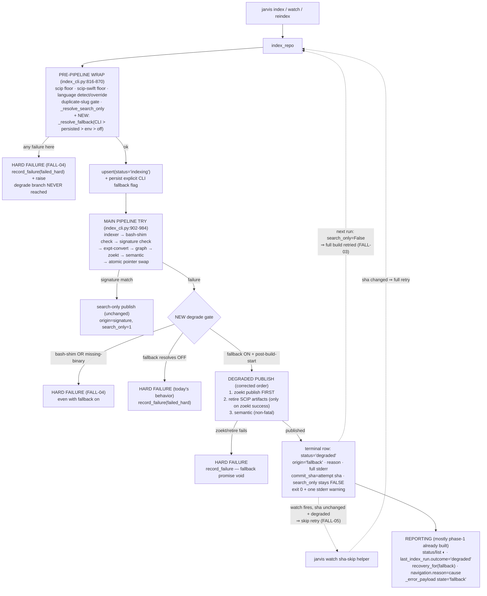

# Phase 3: Opt-In Self-Healing Fallback - Research

**Researched:** 2026-08-22
**Domain:** Indexing pipeline failure handling (Python 3.12, stdlib sqlite3, argparse CLI, FastMCP reporting)
**Confidence:** HIGH (all load-bearing claims verified against repo source this session; no web sources needed — brownfield extension of patterns already in-tree)

<user_constraints>
## User Constraints (from CONTEXT.md)

### Locked Decisions

**Degraded run outcome & reporting (Area 1 — accepted as proposed):**
- Degraded run exits **0** with one stderr warning line: something queryable was published; degradation is visible via `jarvis status` / `getIndexStatus` (scripts keep working).
- Degraded terminal row: `status='degraded'`, `origin='fallback'`, reason + full stderr persisted through the phase-1 additive taxonomy slot (`ORIGIN_FALLBACK` constant + `recovery_for` branch). Never reuses permanent `search_only=1` semantics.
- `jarvis list` renders degraded rows as **◐** with the reason in the 6th field — a partial-health variant of the existing glyph family (✗/◐/✓).
- MCP: `last_index_run.outcome='degraded'`; `capabilities.navigation.reason` names the actual failure cause; nav-tool `_error_payload` state='fallback'. Zero payload reshaping — slots into the phase-1 D-13/D-14 payload contracts.

**Opt-in surface & flag semantics (Area 2 — accepted as proposed):**
- `jarvis watch` accepts the same tri-state `--fallback-search-only` / `--no-fallback-search-only` flag (persists per-repo like `--scheme`/`--language`); watch is just another reindex driver.
- `jarvis reindex <slug>` honors the persisted value silently — no new flag on reindex (mirrors `--scheme`/`--language` handling).
- `JARVIS_FALLBACK_SEARCH_ONLY` parses a strict truthy set `1/true/yes/on` (case-insensitive); any other value warns once to stderr and is treated as off — loud misconfiguration beats silent.
- `--no-fallback-search-only` on an already-degraded repo governs future runs immediately: next reindex with a still-broken indexer is a hard failure. The degraded state never traps; opt-out is immediate.
- Precedence (locked by FALL-02): CLI > persisted > env > off.

**Self-heal & retry mechanics (Area 3 — accepted as proposed):**
- Watch retry-skip keying (FALL-05): persist the **last full-build attempt sha**; watch skips the full-build retry only when the source sha is unchanged AND the row is degraded. Explicit `jarvis index` always retries the full build (FALL-03).
- If the degraded publish itself fails (e.g. zoekt error during the fallback publish): hard failure with cause persisted — nothing was published, the fallback promise is void.
- Post-build-start boundary (FALL-04 inverse): degrade-eligible from the indexer subprocess invocation onward — indexer failure, `scip expt-convert`, graph populate, main-pipeline zoekt. Pre-pipeline gates (binary presence, version floors including the scip-swift floor, bash-shim path, language detection, duplicate-slug) stay hard failures even with fallback enabled.
- `recovery_for(ORIGIN_FALLBACK)`: "fix the indexer failure, then `jarvis reindex <slug>` (full build retries automatically)" — matches the signature/search-only recovery verb and names the self-heal.

### Claude's Discretion
None flagged during discussion — all areas resolved with explicit answers.

### Deferred Ideas (OUT OF SCOPE)
None — discussion stayed within phase scope.
</user_constraints>

<phase_requirements>
## Phase Requirements

| ID | Description | Research Support |
|----|-------------|------------------|
| FALL-01 | With fallback enabled, a post-build-start SCIP indexer failure publishes a search-only index (Zoekt + semantic queryable) instead of leaving the repo with nothing | Degrade branch in `index_repo`'s main-pipeline except handler reuses `_publish_search_only` (semantic non-fatal inside it) with corrected zoekt-before-retire ordering (Patterns 3–4, Pitfalls 1–2) |
| FALL-02 | Fallback is opt-in — persisted per-repo tri-state CLI flag + global `JARVIS_FALLBACK_SEARCH_ONLY` env var; precedence CLI > persisted > env > off | New `fallback_enabled` tri-state column + `_resolve_fallback` following the `_resolve_*` family — with the critical deviation that only the *explicit CLI value* is persisted, never the resolved bool (Pattern 2) |
| FALL-03 | Degraded state self-heals — every reindex/watch retries the full build first, degrading again only on fresh failure | Degraded rows keep `search_only=False` so `_resolve_search_only` never short-circuits the build; success upsert's D-04 conflict list already NULL-clears origin/reason/stderr |
| FALL-04 | Pre-build failures (missing binary, version check, bash-shim) stay hard failures even with fallback enabled | Structural: version/language/duplicate-slug gates raise inside the pre-pipeline wrap that never reaches the degrade branch; bash-shim and missing-binary need explicit exclusion at the degrade site (Pattern 3, Pitfall 3) |
| FALL-05 | Watch doesn't treadmill a persistently-failing degraded repo (sha-keyed retry skip) | Sha of the last full-build attempt persisted on the degraded row (`commit_sha`); a pure skip-check helper consulted by `_cmd_watch` before invoking `index_repo` (Pattern 5) |
</phase_requirements>

## Project Constraints (from CLAUDE.md / AGENTS.md)

- Python 3.12+, modern type hints: `T | None` (never `Optional[T]`), `list[T]`, `dict[K, V]`. [CITED: AGENTS.md "Coding Style & Naming Conventions"]
- Result types are frozen dataclasses (no Pydantic); MCP tools return dicts. [CITED: AGENTS.md]
- Raw `sqlite3` only (no ORM); **always parameterized queries**; additive schema via the existing idempotent `_ensure_column` helper. [CITED: AGENTS.md + registry.py:52-68]
- Env var overrides are `JARVIS_`-prefixed and env reads live in `config.py` (house pattern: `JARVIS_DATA_DIR` read inside `config.data_dir`, config.py:62-66 — not scattered across modules). [VERIFIED: src/jarvis/config.py:62-66]
- Comments document *why*, not *what*; docstrings carry rationale. [CITED: AGENTS.md]
- Tests mirror source modules (`test_<module>.py`); unit tests mock subprocess/file I/O; `uv run pytest -m "not integration" -rs` is the CI gate. [CITED: AGENTS.md "Testing Guidelines"]
- Conventional Commits, lowercase imperative subjects. [CITED: AGENTS.md]
- Simplicity-first / surgical changes: touch only what the phase needs; match existing style. [CITED: ~/.claude/CLAUDE.md]

## Summary

Phase 3 wires an opt-in degrade branch into `index_repo`'s main-pipeline failure handler. Today that handler (`src/jarvis/index_cli.py:985-994`, current HEAD) does `record_failure(ORIGIN_FAILED_HARD)` + raise for every failure after the indexer subprocess starts. Phase 3 inserts a resolution step (`fallback_enabled`, precedence CLI > persisted > env > off) so that, when on, a post-build-start failure instead publishes Zoekt + semantic via the existing `_publish_search_only` path, stamps a **new terminal state** — `status='degraded'`, `origin='fallback'`, reason + full stderr — returns the slug (exit 0, one stderr warning), and leaves `search_only=False` so every later run retries the full build. Reporting needs almost nothing: phase 1 built the taxonomy additive-by-design — `last_index_run.outcome` mirrors the status string verbatim and `origin_of`/`recovery_for` are read-time mappings, so `degraded`/`fallback` flow through `jarvis status`, `getIndexStatus`, and nav-tool error payloads with one new `recovery_for` branch plus one `capabilities.navigation.reason` branch (a real gap found this session — see Pattern 6).

**The critical schema fact for the planner:** the `fallback_enabled` column does **not** exist yet. ROADMAP's "Depends on Phase 1 (registry columns `fallback_enabled`/`status_reason`)" is half-true — Phase 1 shipped only `status_origin`/`status_reason`/`status_stderr` (registry.py:45-47, 170-172); `fallback_enabled` was deferred and is Phase 3's to add via `_ensure_column` (additive, NULL default). The `registry.py:23-26` comment already reserves the slot: "Additive -- Phase 3's `degraded` slots in as one new constant plus one recovery_for branch, with no schema or payload change."

**The critical design subtlety:** the `_resolve_scheme`/`_resolve_language` persistence pattern does **not** transfer verbatim. Those resolvers return the effective value and every terminal `upsert` writes it back — harmless for strings, but persisting the *resolved* fallback bool would collapse the tri-state: a first run with env-off and NULL persisted would write `0` (explicit off), permanently overriding a later env-on. Only the **explicit CLI value** may be persisted (None = leave the stored value alone), which needs a write mechanism that upsert's ON CONFLICT full-overwrite list cannot express directly — either a COALESCE in the conflict clause or (recommended, matches house style) a dedicated setter method like `mark_tracked_files`/`mark_semantic_indexed`, which exist precisely because "upsert's ON CONFLICT list would then reset it" (registry.py:296-298).

**Primary recommendation:** one plan wave adding (a) registry: `DEGRADED_STATUS` + `ORIGIN_FALLBACK` + `fallback_enabled` column + `status_stderr` carrier for the degraded terminal write + `recovery_for` branch; (b) `index_cli`: `_resolve_fallback` + degrade branch in the main-pipeline except + corrected zoekt-before-retire ordering in `_publish_search_only` + `--fallback-search-only` on index/watch parsers + degraded rendering in `list`; (c) `config.py`: `JARVIS_FALLBACK_SEARCH_ONLY` strict-truthy accessor; (d) `server.py`: the `navigation.reason` degraded branch; (e) `index_cli._cmd_watch`: sha-keyed skip helper + flag pass-through. All unit-testable against existing fixtures with `_run`/`check_scip_version` monkeypatches; no new packages, no new files.

## Architectural Responsibility Map

| Capability | Primary Tier | Secondary Tier | Rationale |
|------------|-------------|----------------|-----------|
| Fallback resolution (CLI/persisted/env precedence) | `index_cli.py` (`_resolve_fallback`) | `config.py` (env accessor) | Precedence is a pipeline-run decision; the env *read* belongs in config per the `JARVIS_DATA_DIR` house pattern |
| Persisted tri-state flag storage | `registry.py` (`repos` table) | — | Registry owns all persisted per-repo state (overrides, search_only, failure facts) |
| Degrade decision (post-build-start boundary) | `index_cli.py` (`index_repo` except handler) | — | The pipeline is the only place that knows which step failed and holds the exception text |
| Degraded publish (Zoekt + semantic) | `index_cli.py` (`_publish_search_only`) | — | Reuse the existing search-only publish; ordering fix benefits all callers |
| Degraded status string + origin taxonomy | `registry.py` (constants) | `index_cli.py` (writes) | Status strings and origins are registry-owned vocabulary (D-01) |
| Degraded rendering (CLI) | `index_cli.py` (`_cmd_list`, `_cmd_status`) | — | `_cmd_status` already origin-driven; only `_cmd_list` glyph/6th-field needs a branch |
| Degraded reporting (MCP) | `server.py` (`_capability_fields`, `_error_payload`) | — | Read-only over registry rows; additive branches only |
| Watch retry-skip policy | `index_cli.py` (`_cmd_watch` + pure helper) | `registry.py` (row read) | Skip is a *driver* policy — `index_repo` itself must always retry (FALL-03) |
| Env var parsing + misconfig warning | `config.py` | `index_cli.py` (warn at resolve time) | Env reads live in config; "warn once" happens naturally because resolution runs once per `index_repo` |

## Standard Stack

### Core
| Library | Version | Purpose | Why Standard |
|---------|---------|---------|--------------|
| Python stdlib `argparse` | 3.12+ (`requires-python = ">=3.12,<3.15"`) | `BooleanOptionalAction` for `--fallback-search-only` / `--no-fallback-search-only`, `default=None` | Generates exactly the tri-state pair the locked decision names; stdlib, already the CLI's framework [VERIFIED: pyproject.toml `requires-python`; argparse.BooleanOptionalAction probed present this session] |
| Python stdlib `sqlite3` | 3.12+ | `fallback_enabled` column via `_ensure_column`; all writes parameterized | Raw sqlite3 is a repo rule (no ORM) [CITED: AGENTS.md] |
| pytest | >=8.3 (dev group) | Unit tests mirroring source modules | Existing framework; CI gates `-m "not integration"` [VERIFIED: pyproject.toml [tool.pytest.ini_options]] |

### Supporting
| Library | Version | Purpose | When to Use |
|---------|---------|---------|-------------|
| `watchdog` (optional extra `watch>=4.0`) | >=4.0 | Only if a test drives `_cmd_watch` end-to-end | Not needed: the sha-skip helper must be a pure function so tests never import watchdog (see Pattern 5) [VERIFIED: pyproject.toml optional-dependencies] |

### Alternatives Considered
| Instead of | Could Use | Tradeoff |
|------------|-----------|----------|
| `BooleanOptionalAction` | manual `--fallback-search-only`/`--no-...` pair via two `add_argument` calls | More code, same result; BooleanOptionalAction is one declaration and prior milestone research already recommended it |
| Sha-keyed retry skip | time-based cooldown/backoff for watch | Cooldown re-runs doomed builds on a timer and adds clock state; sha-keying uses state the registry already stores (Pitfall 10, PITFALLS.md:224-225) |
| `commit_sha` reuse for the attempt sha | dedicated `last_attempt_sha` column | A new column duplicates a value the degraded terminal write already persists; reuse keeps the migration one column (`fallback_enabled`) — recommended (see Open Question 3) |

**Installation:** none — zero new packages.

**Version verification:** no external packages introduced; stdlib features verified against the pinned interpreter floor (`>=3.12,<3.15`) and probed locally (`argparse.BooleanOptionalAction` present).

## Package Legitimacy Audit

Not applicable — this phase installs no external packages (stdlib + existing dev dependencies only). No registry checks required.

## Architecture Patterns

### System Architecture Diagram



Trace the primary use case (FALL-01): opt-in → induced indexer failure → degrade gate → degraded publish (zoekt first) → terminal degraded row → exit 0 → `getIndexStatus` reports `degraded`/`fallback` with cause + recovery → user fixes toolchain → next `jarvis index` (search_only=False) retries the full build → success upsert clears failure fields (D-04) → `indexed`.

### Recommended Project Structure
```
src/jarvis/
├── registry.py      # +DEGRADED_STATUS, +ORIGIN_FALLBACK, +fallback_enabled column,
│                    #  +status_stderr carrier on the degraded terminal write,
│                    #  +recovery_for(ORIGIN_FALLBACK) branch
├── index_cli.py     # +_resolve_fallback, +degrade branch in index_repo's main except,
│                    #  corrected _publish_search_only ordering, +parser flags (index+watch),
│                    #  +list degraded rendering, +watch sha-skip helper + flag pass-through
├── config.py        # +JARVIS_FALLBACK_SEARCH_ONLY strict-truthy accessor
└── server.py        # +capabilities.navigation.reason degraded branch (only real change)
tests/
├── test_registry.py       # column migration, tri-state roundtrip, recovery_for(fallback)
├── test_index_cli.py      # degrade branch, precedence matrix, boundary, self-heal, watch skip
├── test_server_tools.py   # degraded last_index_run / capabilities / error payload
└── (test_watch.py unchanged — Debouncer/should_ignore_path untouched)
```

No new modules; all edits land in the four existing files plus their mirrored test files.

### Pattern 1: The two failure handlers of `index_repo` (where FALL-04's boundary already lives)
**What:** `index_repo` has exactly two exception handlers, and the FALL-04 boundary is the gap between them — no new boundary needs to be invented, only respected.

Pre-pipeline wrap (raises never reach any degrade branch) [VERIFIED: src/jarvis/index_cli.py:816-870]:
```python
    try:
        check_scip_version()
        search_only = _resolve_search_only(registry, slug, search_only)
        language_override = _resolve_language(registry, slug, language)
        ...detect_language / swift floor / _swift_indexer_cmd...
    except Exception as exc:
        ...registry.record_failure(
            slug, str(repo_path),
            resolved_language if resolved_language is not None else UNKNOWN_LANGUAGE,
            ORIGIN_FAILED_HARD, reason, text)
        registry.close()
        raise
```
Everything in this wrap — scip floor, scip-swift floor (`MIN_SCIP_SWIFT_VERSION = (0, 3, 0)`, index_cli.py:81), language detection, stale-override, duplicate-slug — is structurally a hard failure: it raises before the main pipeline try is entered. **FALL-04's version-check and language/duplicate-slug clauses are satisfied by doing nothing.**

Main-pipeline handler (the degrade insertion point) [VERIFIED: src/jarvis/index_cli.py:985-994]:
```python
    except Exception as exc:
        text = str(exc)
        reason = next((line for line in text.splitlines() if line.strip()),
                      exc.__class__.__name__)
        registry.record_failure(slug, str(repo_path), language, ORIGIN_FAILED_HARD,
                                reason, text)
        raise IndexingError(str(exc)) from exc
    finally:
        registry.close()
```
This handler sees failures from: the indexer subprocess (re-raised after the bash-shim/signature checks at index_cli.py:907-931), `scip expt-convert` (:932-936), graph populate (:943-950), main-pipeline zoekt (:952-959), semantic stage is non-fatal by construction, and the pointer swap (:963-970). Per the locked CONTEXT decision, all of these are degrade-eligible "from the indexer subprocess invocation onward". The degrade branch slots between `text = str(exc)` and the `record_failure` call.

**When to use:** exactly one insertion point; do not add degrade handling anywhere else.

### Pattern 2: Tri-state resolution — copy the `_resolve_*` shape, NOT its persistence write
**What:** The resolver family to copy [VERIFIED: src/jarvis/index_cli.py:570-600]:
```python
def _resolve_scheme(registry: Registry, slug: str, scheme: str | None) -> str | None:
    if scheme is not None:
        return scheme
    existing = registry.get(slug)
    return existing.scheme_override if existing is not None else None
```
`_resolve_fallback(registry, slug, cli: bool | None) -> bool` adds one tier between persisted and False: when CLI is None and the persisted value is NULL, read the env accessor from `config.py`; when the env value is unset/non-truthy → `False`.

**The persistence deviation (load-bearing):** `_resolve_scheme`'s callers persist the *resolved* value back through every terminal `upsert` (`scheme_override=scheme` at index_cli.py:873-875, 899-900, 924-927, 973-974) — idempotent for strings. Persisting a *resolved bool* would erase the tri-state: first run with `fallback_enabled NULL` + env off resolves `False`; writing `False` back as `0` turns "never set, defer to env" into "explicitly disabled", which outranks a later env-on (precedence locked as CLI > persisted > env > off). **Only the explicit CLI value may be persisted.**

Two mechanisms, pick one at plan time:
- **(a) recommended — dedicated setter**, matching the existing precedent whose docstring explains exactly this hazard [VERIFIED: src/jarvis/registry.py:293-303]:
  ```python
  def mark_tracked_files(self, slug: str, count: int) -> None:
      """Record how many git-tracked blobs the last successful index saw.

      Deliberately not a column on `upsert`: a reindex upserts `indexing`
      before the count is known, and `upsert`'s ON CONFLICT list would then
      reset it to NULL.
      """
  ```
  A `set_fallback_enabled(slug, value: bool)` UPDATE (or INSERT..ON CONFLICT so it also works before the first row exists — see Open Question 4) called once when the CLI flag was explicit. Mirrors `mark_semantic_indexed`'s shape.
- **(b) upsert param with COALESCE**: `fallback_enabled=COALESCE(excluded.fallback_enabled, repos.fallback_enabled)` in the ON CONFLICT list, callers always pass the *raw CLI value* (None included). Fewer methods, but the ON CONFLICT list becomes value-dependent (every other entry is a plain `excluded.*`), and None-in-VALUES on the INSERT branch is correct only because NULL is the "defer" default.

**When to use:** resolution alongside the other `_resolve_*` calls in the pre-pipeline wrap (index_cli.py:823-841) — before the pipeline runs, so the flag is resolved and persistable regardless of outcome.

### Pattern 3: The failure-precedence ladder inside the degrade gate
**What:** At the degrade site the exception is one string; the ladder (top wins) must be explicit:

1. **bash-shim** — classified from indexer output *after* the build starts, but the locked CONTEXT decision puts "bash-shim path" in the pre-pipeline-gate list: environment misconfiguration, never degrade-eligible. Today it re-raises with the remedy prepended [VERIFIED: src/jarvis/index_cli.py:912-913]:
   ```python
   if language == "java" and _bash_shim_failure(str(exc)):
       raise IndexingError(f"{_BASH_SHIM_REMEDY}\n\n{exc}") from exc
   ```
   The re-raised exception reaches the outer handler carrying both tokens still (`_BASH_SHIM_TOKENS = ("LAUNCHER_ARGS[@]", "unbound variable")`, index_cli.py:141), so the degrade gate can re-check `_bash_shim_failure(text)` and re-raise — or the shim branch can re-raise a distinguishable type/attribute (see Open Question 2).
2. **missing binary** — `_run` translates `FileNotFoundError` into `IndexingError(f"{step} failed: {cmd[0]} not found on PATH — run setup.sh")` [VERIFIED: src/jarvis/index_cli.py:367-370]. Degrading on it would launder "setup.sh wasn't run" into a published index (Pitfall 5). Distinguish by a dedicated exception subclass raised at that site (e.g. `MissingBinaryError(IndexingError)`) — cleaner than substring-matching "not found on PATH", and existing `except IndexingError` sites keep working since the subclass IS-A base.
3. **signature fallback** — already handled *earlier*, inside the indexer-step try (index_cli.py:914-931); a matched signature returns the permanent `search_only=1` publish before the outer handler is ever reached. The degrade branch therefore never sees signature-matched failures — no precedence conflict, but tests must pin this (an opted-in repo with an ABI-mismatch failure ends `search-only`/origin `signature`, NOT `degraded`).
4. **generic fallback** — the new branch: post-build-start + fallback resolved on + not 1-3 → degraded publish.
5. **hard failure** — anything else (fallback off, gate excluded, or the degraded publish itself failing).

**When to use:** implement the gate as an ordered guard list at the single insertion point from Pattern 1.

### Pattern 4: Corrected degraded-publish ordering (zoekt before retire)
**What:** Today `_publish_search_only` retires SCIP artifacts *first* [VERIFIED: src/jarvis/index_cli.py:703-734]:
```python
    _retire_scip_artifacts(slug, root)
    _pin_zoekt_repo_name(repo_path, slug)
    zoekt_dir = config.data_dir(root) / ".zoekt"
    zoekt_dir.mkdir(parents=True, exist_ok=True)
    tracked = _tracked_blob_count(repo_path)
    result = _run(_zoekt_index_cmd(zoekt_dir, repo_path), cwd=repo_path,
                  step="zoekt-git-index")
```
If zoekt fails there, a previously-good repo has lost navigation AND kept stale search — strictly worse than the triggering failure (Pitfall 4; the ROADMAP note locks the fix: "search published before SCIP artifacts are retired"). Corrected order: pin → zoekt publish → **only on zoekt success** → `_retire_scip_artifacts` → semantic (non-fatal, order-independent) → stderr note.

Notes for the planner:
- Reordering inside `_publish_search_only` fixes all three callers (manual `--search-only`, signature, degraded) with one code path — the CONTEXT's "this path verbatim" stays literally true. The manual/signature end state is unchanged (retire still happens before the terminal write); only the failure window improves.
- Retirement failure (`rmtree` EACCES etc.) after a successful zoekt publish leaves new shards + old pointer + a `failed` row — the same shape the main pipeline already produces on failure-with-live-pointer, which phase 1 declared correct (`test_get_index_status_failed_run_with_live_pointer_reports_stale_navigation`, tests/test_server_tools.py:502-539). Per the locked decision this is a hard failure with cause persisted.
- `_sweep_zoekt_tmp_orphans` and `_warn_on_coverage_shortfall` ride the zoekt step as today (index_cli.py:726-727).
- The retire-on-success decision deliberately keeps stale navigation from outliving the degrade — `_retire_scip_artifacts` exists to prevent the self-contradictory `{"indexed": true, "status": "search-only"}` shape (its docstring, index_cli.py:670-690); the degraded state has the same need (`indexed=false` + `status='degraded'` must stay coherent).

### Pattern 5: Watch sha-skip as a pure, watchdog-free helper
**What:** `watch.py`'s own philosophy — "Kept free of `watchdog`/threading so the debounce guarantee is unit-testable" [VERIFIED: src/jarvis/watch.py:3-10] — applies to the skip policy: `_cmd_watch` currently has no unit tests (only parser tests, tests/test_index_cli.py:1414-1418) because it needs a live Observer. Implement the policy as a module-level pure-ish function in `index_cli.py`:

```python
def _watch_should_retry_full_build(entry: RegisteredRepo | None, current_sha: str) -> bool:
    """FALL-05: watch skips the full-build retry only when the repo is
    degraded AND the source sha is unchanged since the attempt that
    degraded it. Everything else -- indexed rows, failed rows, changed
    shas -- retries (FALL-03: a manual `jarvis index` always retries)."""
```

Consulted by `_cmd_watch._reindex` (index_cli.py:1210-1223) *before* invoking `index_repo`, with the current sha from `_git_head(repo_path)`. Keying facts:
- The degraded terminal write persists `commit_sha=<attempt sha>`, so the row already stores the key — `record_failure` by contrast writes `commit_sha=NULL` (registry.py:255), which is exactly right: hard-failed rows must NOT skip (a `failed` row isn't degraded; the skip checks status first).
- `entry is None` / not-degraded / sha-differs → retry. Skip prints one stderr note (no state churn).
- The skip lives in the driver, never in `index_repo` — FALL-03's "explicit `jarvis index` always retries" is the same function; only the watch driver may decline to call it.
- Watch flag pass-through: `_reindex` currently forwards `scheme=args.scheme, language=args.language` (index_cli.py:1213); add `fallback_search_only=args.fallback_search_only` the same way (None unless the user passed the flag at watch start — exactly the tri-state contract).

### Pattern 6: Reporting — mostly already built; the one real gap
**What:** Phase 1 designed the payload contracts additive so `degraded` flows through untouched:
- `last_index_run.outcome` is the status string verbatim [VERIFIED: src/jarvis/server.py:163-170]: `"outcome": entry.status if entry is not None else None` — a `degraded` row reports `outcome='degraded'` with zero code change; `origin` via `origin_of(entry)` picks up `status_origin='fallback'` verbatim.
- `jarvis status` is fully origin-driven (index_cli.py:1059-1074): `origin:`/`cause:`/`recovery:` lines print for any row with `status_origin`/`status_reason`/recovery — a degraded row needs only the `recovery_for` branch. `jarvis list` needs the glyph branch: degraded joins the ◐ family and gains the 6th reason field (currently failed-only, index_cli.py:1025-1034).
- `_error_payload`: an `IndexNotFoundError` on a degraded row already emits `state='fallback'` + `cause` + `recovery` through the origin keys [VERIFIED: src/jarvis/server.py:244-251] — the search-only prose branch (server.py:233-241) doesn't apply and per CONTEXT isn't required (zero reshaping; the structured keys are the contract).

**The gap:** `_capability_fields`' navigation-unavailable branch [VERIFIED: src/jarvis/server.py:183-190]:
```python
        else:
            if entry is not None and entry.search_only:
                nav_reason = entry.status_reason or "indexed search-only — no SCIP index"
            elif entry is None:
                nav_reason = "no published index"
            else:
                nav_reason = None
```
A degraded row (pointer retired ⇒ `indexed=False`, but `search_only=False`) falls to `nav_reason = None` — violating the locked "capabilities.navigation.reason names the actual failure cause". One added branch (e.g. `elif entry.status == DEGRADED_STATUS: nav_reason = entry.status_reason or <default degraded wording>`) closes it. `nav_recovery = recovery_for(entry)` (server.py:190) then carries the new recovery verb automatically.

### Anti-Patterns to Avoid
- **Persisting the resolved bool** (Pattern 2) — collapses the tri-state and locks env-on out of a repo that merely ran once with env off.
- **Catching `Exception` at the degrade site without the exclusion ladder** — launders bash-shim/missing-binary misconfiguration into "degraded" publishes (FALL-04 violation, Pitfall 5).
- **Writing `search_only=True` on the degraded row** — the one-way trap (Pitfall 3): `_resolve_search_only` would then skip every future build; self-heal dies. Warning sign from PITFALLS.md:71: "A test that opts in, fails once, then reindexes with a working build must end at status `indexed`".
- **Retire-before-zoekt in the degraded path** — destroys a good index on a zoek hiccup (Pitfall 4). Warning sign (PITFALLS.md:94): previously-`indexed` + opted-in + indexer failure + zoekt failure ⇒ old `current` pointer must still exist.
- **Putting the sha-skip inside `index_repo`** — breaks FALL-03 (manual index must always retry); the skip is a watch-driver policy.
- **A new payload shape for degraded** — phase-1 D-13/D-14/D-15 contracts are additive by design; only the `nav_reason` branch is new.
- **Degrade on failures from the pre-pipeline wrap** — structurally impossible if the branch lives only in the main-pipeline except (keep it that way; don't "unify" the two handlers).

## Don't Hand-Roll

| Problem | Don't Build | Use Instead | Why |
|---------|-------------|-------------|-----|
| Tri-state CLI flag pair | two mutually-exclusive `add_argument` flags with manual conflict checks | `argparse.BooleanOptionalAction(default=None)` | One declaration yields `--fallback-search-only`/`--no-fallback-search-only` with None default — exactly the `--scheme`/`--language` "None means leave persisted alone" contract, avoids the `--search-only` set-but-never-clearable trap the repo already documents (index_cli.py:132-137) |
| Env parsing | ad-hoc `os.environ.get` truthiness sprinkled at call sites | one strict accessor in `config.py` (`1/true/yes/on` case-insensitive; else warn-once + off) | `JARVIS_` env reads live in config (house pattern, config.py:62-66); strict set + loud warning is the locked misconfiguration policy |
| Degraded publish | a second search-only publish path | `_publish_search_only` with corrected ordering | One publish path; the ordering fix benefits manual/signature callers too; a forked path doubles the surface for the exact invariant mistakes Pitfall 4 catalogs |
| Retry-key state | a new `last_attempt_sha` column + bookkeeping | the degraded terminal write's `commit_sha` | The sha IS the attempt sha; reusing it keeps the migration one column and gives `record_failure`'s `commit_sha=NULL` the correct never-skip semantics for free |
| Recovery wording | persisted per-row recovery strings | `recovery_for()` read-time branch | D-09: "a mapping in code, never persisted per-row, so wording changes and Phase 3's `degraded` origin need no data migration" [VERIFIED: src/jarvis/registry.py:137-150] |
| Status glyph/payload enums | new consumer-side enums or reshaped payloads | status string verbatim + origin taxonomy | Phase-1 resolutions #3/D-13: "the registry status string verbatim — no new outcome enum to maintain" [VERIFIED: src/jarvis/server.py:163-166] |

**Key insight:** every mechanism this phase needs — additive column migration, tri-state resolution, origin taxonomy, read-time recovery, additive MCP payload keys, atomic publish discipline — already exists in-tree from phases 0–1 and was explicitly designed with Phase 3's slot reserved (registry.py:23-26). The phase is assembly, not invention; the genuinely new decisions are the persistence-subtlety (Pattern 2), the exclusion ladder (Pattern 3), and the ordering fix (Pattern 4).

## Runtime State Inventory

> Phase adds schema columns (migration-adjacent) but renames nothing — completed for due diligence per the rename/refactor checklist.

| Category | Items Found | Action Required |
|----------|-------------|------------------|
| Stored data | `~/.jarvis/registry.db` `repos` table: existing rows lack `fallback_enabled`; new column migrates in lazily as NULL ("never set, defer to env") on first open | None — additive `_ensure_column`; no data migration (existing rows keep exact semantics; `search_only=1` rows untouched) |
| Live service config | A long-running `jarvis-server` (MCP) holds no registry cache — `_registry_entry` opens/reads/closes per call [VERIFIED: src/jarvis/server.py:66-80] | None — a live server sees `degraded` rows immediately once server.py's branch lands (both ship in this phase) |
| OS-registered state | None — verified: no launchd/systemd/pm2/Task Scheduler integration exists in the repo (grep of src/ + AGENTS.md structure) | None |
| Secrets/env vars | New read-only env var `JARVIS_FALLBACK_SEARCH_ONLY` (locked name); no secrets, no renamed keys | None — additive read; document beside the other `JARVIS_*` vars |
| Build artifacts | None — pure-Python dev tree (compilation only under `JARVIS_COMPILE=1` release CI) [CITED: AGENTS.md] | None — `uv run pytest` unaffected |

## Common Pitfalls

### Pitfall 1: Persisting the resolved fallback bool (the `_resolve_scheme` copy-paste trap)
**What goes wrong:** Copying the scheme/language persistence idiom (write the resolved value back on every terminal upsert) collapses NULL→0 on the first env-off run; the repo is then permanently opted out of a future env-on because persisted outranks env.
**Why it happens:** The `_resolve_*` family looks uniform; the string members are idempotent under write-back, the tri-state member is not.
**How to avoid:** Persist only the explicit CLI value via a setter that leaves the stored value alone on None (Pattern 2). Test: row stays NULL after a run with no CLI flag and env unset.
**Warning signs:** A registry dump showing `fallback_enabled=0` on a repo the user never flagged.

### Pitfall 2: The degrade branch catching environment misconfiguration (FALL-04 leak)
**What goes wrong:** bash-shim failures and missing binaries arrive at the outer handler as ordinary `IndexingError` strings; a naive `if fallback_enabled: degrade` publishes a search-only index for a repo whose real problem is `setup.sh` or `brew install bash` — one-command fixes hidden behind a degraded state (PITFALLS.md Pitfall 5).
**Why it happens:** At the catch site everything is the same exception type carrying a string.
**How to avoid:** The ordered exclusion ladder (Pattern 3): bash-shim re-check (or distinguishable re-raise), `MissingBinaryError` subclass from `_run`'s FileNotFoundError site, signature path already pre-empts.
**Warning signs:** Unit test — opted-in repo + missing binary ⇒ raises, no publish (PITFALLS.md:115).

### Pitfall 3: Degraded publish destroys the existing index (retire-then-fail)
**What goes wrong:** `_publish_search_only`'s current retire-first ordering means a zoekt failure during the degraded publish deletes a previously-good SCIP index — the repo ends worse than before the fallback fired (PITFALLS.md Pitfall 4).
**Why it happens:** The ordering predates the retryable-degrade use case; it was safe for permanently-doomed signature repos.
**How to avoid:** zoekt publish before `_retire_scip_artifacts`, retire only on publish success (Pattern 4).
**Warning signs:** PITFALLS.md:94 test — old `current` pointer must survive an indexer+zoekt double failure on an opted-in previously-indexed repo.

### Pitfall 4: Precedence split-brain across trigger paths
**What goes wrong:** Env read at different times/processes (user shell vs watch's inherited env vs MCP-spawned runs) makes the same repo degrade under one trigger and hard-fail under another, inexplicably (PITFALLS.md Pitfall 7).
**Why it happens:** Env vars look like a cheap global toggle; nobody enumerates the resolution matrix.
**How to avoid:** One resolver, docstring stating CLI > persisted > env > off; unit-test the full matrix (env on/off × persisted on/off/NULL × CLI on/off/absent — 12 cells, cheap to parametrize). The persisted flag makes the per-repo decision durable across environments, which is the point of having both.
**Warning signs:** Same repo, different outcome per trigger path in tests.

### Pitfall 5: Watch treadmill on a persistently-failing degraded repo
**What goes wrong:** Self-heal ("retry every run") + watch (reindex on every debounced save) = a doomed multi-minute build per save cycle (PITFALLS.md Pitfall 10).
**Why it happens:** Self-heal and retry-cost are in direct tension; the trap state gets designed away and the treadmill forgotten.
**How to avoid:** Sha-keyed skip in the watch driver only (Pattern 5): skip iff degraded AND unchanged sha; manual index never skips.
**Warning signs:** Watch logs showing repeated full-build cycles ending in the same degrade note at one sha.

### Pitfall 6: The `capabilities.navigation.reason = None` gap
**What goes wrong:** Degraded rows are `search_only=False`, so the existing nav-unavailable branch yields `reason: None` — an MCP client branching on the reason field gets nothing, violating the locked "reason names the actual failure cause" (found this session; see Pattern 6).
**Why it happens:** Phase 1's branch predicates on `entry.search_only`, which the new state deliberately doesn't set.
**How to avoid:** Add the `DEGRADED_STATUS` branch to `_capability_fields`; assert reason == status_reason in a test.
**Warning signs:** `getIndexStatus` on a degraded repo showing `reason: null`.

### Pitfall 7: `record_failure`'s `commit_sha=NULL` colliding with the watch skip
**What goes wrong:** If the degraded write went through `record_failure` (or skipped stamping sha), the skip key would be NULL and `None == sha` never matches — treadmill returns; or worse, a lenient `!=` check makes every hard-failed row skip forever.
**Why it happens:** `record_failure` deliberately NULLs `commit_sha` (D-06 full-overwrite, registry.py:255); the degraded write has different needs.
**How to avoid:** Degraded terminal write persists `commit_sha=sha` (it IS a publish); skip predicate requires `status == DEGRADED_STATUS` first, so NULL sha on failed rows is irrelevant.
**Warning signs:** Watch-skip test using a `failed` row must retry.

## Code Examples

> Skeletons illustrate shape only; exact names/wording are plan-time discretion unless a locked decision names them. Every in-repo value quoted below is verbatim from this session's reads with citations.

### Resolution + env accessor (FALL-02)
```python
# config.py — house pattern: env reads live in config (JARVIS_DATA_DIR precedent,
# config.py:62-66). Strict truthy set is a locked CONTEXT decision.
_FALLBACK_TRUTHY = frozenset({"1", "true", "yes", "on"})

def fallback_search_only_from_env() -> bool:
    """JARVIS_FALLBACK_SEARCH_ONLY global default. Strict truthy set
    1/true/yes/on (case-insensitive); any OTHER value warns once to stderr
    and reads as off — loud misconfiguration beats silent. Unset = off."""
    raw = os.environ.get("JARVIS_FALLBACK_SEARCH_ONLY")
    if raw is None:
        return False
    if raw.strip().lower() in _FALLBACK_TRUTHY:
        return True
    print(f"warning: JARVIS_FALLBACK_SEARCH_ONLY={raw!r} is not one of "
          "1/true/yes/on — treating as off", file=sys.stderr)
    return False
```
```python
# index_cli.py — resolution tier order is the locked precedence
# (CLI > persisted > env > off); persistence contract per Pattern 2.
def _resolve_fallback(registry: Registry, slug: str, cli: bool | None) -> bool:
    if cli is not None:
        return cli
    existing = registry.get(slug)
    if existing is not None and existing.fallback_enabled is not None:
        return existing.fallback_enabled
    return config.fallback_search_only_from_env()
```

### Registry additions (FALL-01/02/03 carrier state)
```python
# registry.py — constants beside the existing taxonomy, whose comment already
# reserves the slot [VERIFIED: src/jarvis/registry.py:23-29]:
#   ORIGIN_FAILED_HARD = "failed_hard"
#   ORIGIN_SIGNATURE = "signature"
#   ORIGIN_MANUAL = "manual"
DEGRADED_STATUS = "degraded"      # beside SEARCH_ONLY_STATUS = "search-only" (:21)
ORIGIN_FALLBACK = "fallback"
# _SCHEMA gains:  fallback_enabled INTEGER   -- tri-state NULL/0/1 (NULL = defer to env)
# __init__ migrates:  _ensure_column(self._conn, "fallback_enabled", "INTEGER")
# RegisteredRepo gains:  fallback_enabled: bool | None = None  (+ _row_to_repo,
#   + SELECT column lists in get()/list())
```
```python
# recovery_for branch — locked wording (CONTEXT Area 3); mirrors the existing
# per-origin returns [VERIFIED: src/jarvis/registry.py:144-150]:
#   ORIGIN_FAILED_HARD -> f"jarvis index {entry.path}"
#   ORIGIN_SIGNATURE   -> f"jarvis reindex {entry.slug}"
#   ORIGIN_MANUAL      -> f"jarvis forget {entry.slug} && jarvis index {entry.path}"
if origin == ORIGIN_FALLBACK:
    return f"fix the indexer failure, then `jarvis reindex {entry.slug}` (full build retries automatically)"
```
Degraded terminal write (shape — mechanism choice is Open Question 1): must persist `status=DEGRADED_STATUS`, `status_origin=ORIGIN_FALLBACK`, `status_reason=<one-line reason>`, `status_stderr=<full text>` (D-02/D-03 carriers), `commit_sha=sha` (the FALL-05 key), `search_only=False`, plus the resolved scheme/language/semantic_include like every terminal write, then `mark_tracked_files` / `mark_semantic_indexed` as the search-only path does (index_cli.py:923-930).

### Degrade branch (FALL-01/03/04) — at the Pattern 1 insertion point
```python
    except Exception as exc:
        text = str(exc)
        reason = next((line for line in text.splitlines() if line.strip()),
                      exc.__class__.__name__)
        if (fallback_enabled
                and not isinstance(exc, MissingBinaryError)          # FALL-04
                and not _bash_shim_failure(text)):                   # FALL-04
            semantic_ok, tracked = _publish_search_only(repo_path, slug, root,
                                                        semantic_include)
            registry.upsert(slug, str(repo_path), language, sha, DEGRADED_STATUS,
                            scheme_override=scheme, semantic_include=semantic_include,
                            language_override=language_override,
                            status_origin=ORIGIN_FALLBACK, status_reason=reason,
                            status_stderr=text)                      # carrier: OQ-1
            registry.mark_tracked_files(slug, tracked)
            if semantic_ok:
                registry.mark_semantic_indexed(slug)
            print(f"warning: {slug} degraded to search-only — {reason}. "
                  "Navigation tools are unavailable; the next reindex retries "
                  "the full build.", file=sys.stderr)                # one line, exit 0
            return slug
        registry.record_failure(slug, str(repo_path), language, ORIGIN_FAILED_HARD,
                                reason, text)
        raise IndexingError(str(exc)) from exc
```
(Signature-matched failures never reach here — the inner handler at index_cli.py:907-931 returns first; pin with a test.)

### Watch skip + flag pass-through (FALL-05)
```python
def _watch_should_retry_full_build(entry: RegisteredRepo | None, current_sha: str) -> bool:
    """FALL-05: skip only when degraded AND the sha is the one that already
    failed. NULL/failed/indexed rows and changed shas all retry."""
    return not (entry is not None
                and entry.status == DEGRADED_STATUS
                and entry.commit_sha is not None
                and entry.commit_sha == current_sha)
```
In `_cmd_watch._reindex` (currently index_cli.py:1210-1223): read the row via a short-lived Registry, call `_git_head(repo_path)`, skip with a stderr note or call `index_repo(..., fallback_search_only=args.fallback_search_only)` — the pass-through mirrors the existing `scheme=args.scheme, language=args.language` forwarding.

### Parser (both index and watch subparsers)
```python
index_parser.add_argument(
    "--fallback-search-only",
    action=argparse.BooleanOptionalAction, default=None,
    help="on a post-build-start indexer failure, publish search-only and retry "
         "the full build on the next reindex (persisted per-repo; "
         "JARVIS_FALLBACK_SEARCH_ONLY sets the global default)")
```

### Server branch (Pattern 6 gap)
```python
# _capability_fields, navigation-unavailable else-branch (server.py:183-190):
if entry is not None and entry.search_only:
    nav_reason = entry.status_reason or "indexed search-only — no SCIP index"
elif entry is not None and entry.status == DEGRADED_STATUS:
    nav_reason = entry.status_reason or "indexer failure — degraded to search-only"
elif entry is None:
    nav_reason = "no published index"
else:
    nav_reason = None
```

### Test skeleton to mirror (the house pattern for induced failures)
```python
# Existing pattern verbatim [VERIFIED: tests/test_index_cli.py:1796-1827]: mock
# check_scip_version + _run keyed on the step name; zoekt runs "for real"
# against the fake; registry asserted afterwards.
def _fake_run(cmd, *, cwd, step, env=None):
    if step.endswith(" index"):
        raise IndexingError("error: simulated post-build-start failure")
    return _fake_completed_process(cmd)
monkeypatch.setattr("jarvis.index_cli.check_scip_version", lambda: None)
monkeypatch.setattr("jarvis.index_cli._run", _fake_run)
monkeypatch.setattr("jarvis.index_cli._run_semantic_stage", lambda *a, **k: False)
```
New degraded-path tests follow this exactly (plus `index_repo(..., fallback_search_only=True)` / a persisted row / env monkeypatch via `monkeypatch.setenv("JARVIS_FALLBACK_SEARCH_ONLY", ...)`).

## State of the Art

| Old Approach | Current Approach | When Changed | Impact |
|--------------|------------------|--------------|--------|
| `--search-only` `store_true`, set-but-never-clearable | `BooleanOptionalAction` on/off pairs for new tri-state flags | Repo convention since phase-1 research; this phase applies it | Opt-out is immediate (locked: "`--no-fallback-search-only` … governs future runs immediately") |
| One terminal failure state (`failed` + record_failure) | Two: hard failure and degraded publish, distinct origins | This phase | Reporting can distinguish "misconfigured" from "repo broke the build" |
| Retire-then-publish in `_publish_search_only` | Publish-then-retire | This phase (ROADMAP note) | Never-half-published invariant extended to the degrade path |

**Deprecated/outdated:** none in-tree to replace; `--search-only` semantics deliberately unchanged (out-of-scope table, REQUIREMENTS.md:55).

## Assumptions Log

| # | Claim | Section | Risk if Wrong |
|---|-------|---------|---------------|
| A1 | Exact stderr warning line wording for the degraded run (shape shown in Code Examples) is plan/executor discretion; only "one line, exit 0, stderr" is locked | Code Examples | Trivial — wording tweak |
| A2 | `MissingBinaryError` as an `IndexingError` subclass raised at `_run`'s FileNotFoundError site is the cleanest exclusion mechanism; bash-shim exclusion via `_bash_shim_failure(text)` re-check at the degrade gate | Pattern 3, Pitfall 2 | Low — alternative (marker attribute / distinct type for shim) equally small; locked requirement is only "stays a hard failure" |
| A3 | Degraded terminal write goes through `upsert` extended with a `status_stderr` parameter (default None preserves D-04 clearing) rather than a dedicated `record_degraded` method | Open Questions | Low — either mechanism satisfies the locked "reason + full stderr persisted"; choice affects only registry.py surface |
| A4 | Reusing `commit_sha` as the FALL-05 attempt-sha key (no new column) is acceptable; CONTEXT says "persist the last full-build attempt sha" without naming the column | Pattern 5, Open Questions | Low — a dedicated column is a one-line addition if the planner prefers explicitness |
| A5 | Docs/README updates (env-var list at README.md:318-322, docs/code-standards.md:153) are in-scope cleanup for this phase | Open Questions | Low — docs-only; planner may defer to milestone audit |
| A6 | `_publish_search_only` reordering applies to all callers (manual/signature/degraded) rather than forking a degraded-only variant — end states unchanged, only the failure window improves | Pattern 4 | Low-medium — a planner wanting zero behavior delta for manual/signature could fork the path; the repo's own technical-debt table says "Never for the retryable path" for unmodified reuse, and one path is simpler |

## Open Questions

1. **Degraded terminal write mechanism — `upsert(status_stderr=...)` vs dedicated `record_degraded`**
   - What we know: `upsert` already carries `status_origin`/`status_reason` but has no `status_stderr` parameter (D-04 comment: "status_stderr has no upsert parameter at all", registry.py:201-208); the degraded row must carry full stderr (locked). The row always exists at degrade time (the transitional `indexing` upsert ran), so ON CONFLICT applies.
   - What's unclear: whether adding a parameter to `upsert` (default None keeps every success path clearing per D-04) is preferred over a purpose-built method with record_failure-style field-preservation comments.
   - Recommendation: `upsert` param — smallest diff, D-04 semantics preserved by the default; add a test that a subsequent successful plain upsert still NULLs all three failure fields on a previously-degraded row.
2. **Exclusion mechanism for missing-binary/bash-shim at the degrade gate**
   - What we know: both must stay hard failures (locked); bash-shim already re-raises with remedy text (index_cli.py:912-913); missing-binary is translated in `_run` (index_cli.py:367-370).
   - What's unclear: subclass (`MissingBinaryError`) vs substring check vs exception attribute.
   - Recommendation: subclass — typed, testable, no string fragility; the bash-shim re-check reuses the existing pure predicate.
3. **`commit_sha` vs dedicated attempt-sha column (A4)** — recommendation: reuse `commit_sha` (the degraded write publishes search from HEAD, so the sha is factually the attempt sha; `record_failure`'s NULL keeps failed rows always-retrying).
4. **When/where the explicit CLI flag is persisted when the row doesn't exist yet or the run fails pre-pipeline**
   - What we know: persistence must happen for the preference to survive; `set_fallback_enabled` as a bare UPDATE no-ops before the row exists; pre-pipeline failures `record_failure` (creating the row) *after* resolution would run.
   - What's unclear: persist eagerly (INSERT..ON CONFLICT setter) vs on terminal writes only.
   - Recommendation: persist at the same moment the other resolved values ride a write — i.e., call the setter right after the transitional `indexing` upsert (row now exists) when the CLI value was explicit; a pre-pipeline failure then still honors the preference next run.
5. **Degraded nav-error prose in `_error_payload`** — CONTEXT requires only the structured `state/cause/recovery` keys (already flow); a friendlier prose branch (like search-only's) is optional polish. Recommendation: skip — zero-reshaping is the locked contract; prose verbosity buys nothing scriptable.

## Environment Availability

| Dependency | Required By | Available | Version | Fallback |
|------------|------------|-----------|---------|----------|
| uv | test/build commands | ✓ (probed this session) | 0.11.19 | — |
| git | fixtures (`_init_git_repo`), `_git_head` in watch-skip tests | ✓ (probed) | 2.50.1 | — |
| Python ≥3.12 | all code | ✓ (project pins `>=3.12,<3.15`) | 3.12+ | — |
| `argparse.BooleanOptionalAction` | tri-state flag | ✓ (probed) | stdlib | — |
| pytest ≥8.3 | test suite | ✓ (dev group, uv-managed) | 8.3+ | — |
| `watchdog` extra | only if testing `_cmd_watch` end-to-end | not needed | — | sha-skip helper is pure (Pattern 5); parser tests don't import it |
| scip/scip-python/zoekt binaries | integration-marked tests only | self-skipping when absent (`skipif(_missing)`) | — | unit tests mock `_run`; CI runs `-m "not integration"` |

**Missing dependencies with no fallback:** none.
**Missing dependencies with fallback:** none.

## Validation Architecture

### Test Framework
| Property | Value |
|----------|-------|
| Framework | pytest ≥8.3 (dev group), custom marker `integration` |
| Config file | `[tool.pytest.ini_options]` in `pyproject.toml` (`testpaths = ["tests"]`) |
| Quick run command | `uv run pytest -m "not integration" -rs` |
| Full suite command | `uv run pytest` |

### Phase Requirements → Test Map
| Req ID | Behavior | Test Type | Automated Command | File Exists? |
|--------|----------|-----------|-------------------|-------------|
| FALL-01 (publish) | Opted-in + induced post-build-start failure (indexer/convert/graph/zoekt steps) ⇒ publishes zoekt shards + no `current` pointer, terminal row `degraded`/`fallback`/reason/stderr, `search_only=False`, exit path returns slug | unit (mock `_run` by step name — house pattern) | `uv run pytest tests/test_index_cli.py -k "degraded" -q` | ❌ Wave 0 (tests added to existing file) |
| FALL-01 (publish-fail) | Degraded publish's own zoekt failure ⇒ hard failure + failed row; previously-published `current` pointer survives (ordering fix, Pitfall 3) | unit | `uv run pytest tests/test_index_cli.py -k "retire or publish_fail" -q` | ❌ Wave 0 |
| FALL-02 (flag) | `--fallback-search-only`/`--no-...` parse on index+watch; tri-state column roundtrips NULL/0/1; migrates onto pre-phase-3 DB; only explicit CLI persisted (NULL stays NULL when env off) | unit | `uv run pytest tests/test_registry.py tests/test_index_cli.py -k "fallback" -q` | ❌ Wave 0 |
| FALL-02 (env) | `JARVIS_FALLBACK_SEARCH_ONLY` matrix: 1/true/yes/ON ⇒ on; garbage ⇒ warn-once + off; unset ⇒ off; full precedence table CLI×persisted×env | unit (parametrized, `monkeypatch.setenv`) | `uv run pytest tests/test_index_cli.py -k "fallback_precedence or env" -q` | ❌ Wave 0 |
| FALL-03 (self-heal) | Degrade once ⇒ reindex with working indexer ends `indexed`/`search_only=False`, failure fields NULL-cleared (D-04); still-broken ⇒ degrades again; signature-match on an opted-in repo still ends `search-only`/origin `signature` (precedence) | unit (two-phase `_run` mock) | `uv run pytest tests/test_index_cli.py -k "self_heal or degrade" -q` | ❌ Wave 0 |
| FALL-04 (boundary) | Opted-in + scip/swift floor failure, missing binary, bash-shim signature ⇒ raise, no publish, `failed`/`failed_hard` row, `search_only=False` | unit (pre-pipeline wrap + gate exclusions) | `uv run pytest tests/test_index_cli.py -k "hard_failure or pre_pipeline" -q` | ❌ Wave 0 |
| FALL-05 (skip) | Degraded row + unchanged sha ⇒ `_watch_should_retry_full_build` False; sha change / failed row / indexed row / None row ⇒ True; watch parser accepts the flag | unit (pure helper + parser) | `uv run pytest tests/test_index_cli.py -k "watch_should_retry or watch_parser" -q` | ❌ Wave 0 |
| STAT reporting (CLI) | `jarvis list` ◐ + 6th-field reason for degraded; `jarvis status` origin/cause/recovery lines with the fallback verb | unit (capsys) | `uv run pytest tests/test_index_cli.py -k "list or status" -q` | ✅ file exists (tests added) |
| STAT reporting (MCP) | `last_index_run` outcome/origin `degraded`/`fallback`; `capabilities.navigation.reason` = cause + recovery verb; `_error_payload` state='fallback' | unit (direct function calls, existing pattern) | `uv run pytest tests/test_server_tools.py -k "degraded or fallback or last_index_run" -q` | ✅ file exists (tests added) |

All commands unit-scope (<30 s), no external binaries. Sampling covers every requirement at least at per-task rate; the degrade boundary (FALL-04) gets both positive (gate fires) and negative (gate refuses) samples per Nyquist.

### Sampling Rate
- **Per task commit:** `uv run pytest -m "not integration" -rs`
- **Per wave merge:** `uv run pytest` (integration self-skips without binaries)
- **Phase gate:** full suite green before `/gsd-verify-work`; `tdd_mode: true` — failing tests first for each row above

### Wave 0 Gaps
- [ ] `tests/test_index_cli.py` — FALL-01/02/03/04/05 unit tests (degrade branch, precedence matrix, boundary, self-heal two-phase, watch-skip helper, parser, list/status rendering)
- [ ] `tests/test_registry.py` — `fallback_enabled` migration + tri-state roundtrip + `recovery_for(ORIGIN_FALLBACK)` + degraded-row write/clear semantics
- [ ] `tests/test_server_tools.py` — degraded `last_index_run`/`capabilities`/`_error_payload` assertions
- Framework/fixtures: none missing — `_init_git_repo`, `_fake_completed_process`, step-keyed `_run` mocks, `JARVIS_DATA_DIR` isolation, and the raw-sqlite3 legacy-DB builder all exist and are reused as-is.

## Security Domain

`security_enforcement: true`, ASVS level 1 (`.planning/config.json`). Local-first single-user tool: no auth, no sessions, no network surface, no crypto. Phase adds one env-var read and one CLI flag; no new external inputs beyond the existing stderr-persisted indexer output.

### Applicable ASVS Categories

| ASVS Category | Applies | Standard Control |
|---------------|---------|-----------------|
| V2 Authentication | no | None — no auth by design |
| V3 Session Management | no | stdio MCP, no sessions |
| V4 Access Control | no | Single-user local tool; registry.db user-owned |
| V5 Input Validation | yes (narrow) | NEW input: `JARVIS_FALLBACK_SEARCH_ONLY` — validated against a strict frozenset (`1/true/yes/on`, case-insensitive), never interpolated anywhere; all registry writes stay parameterized SQL (repo rule); indexer stderr persisted verbatim per D-02 and carried as JSON data, never executed |
| V6 Cryptography | no | No secrets stored |
| V8 Data Protection | no | n/a — status_stderr already excluded from MCP payloads by the phase-1 key-by-key payload builder (server.py:156-158) |

### Known Threat Patterns for this stack

| Pattern | STRIDE | Standard Mitigation |
|---------|--------|---------------------|
| SQL injection via failure text persisted on degraded rows | Tampering | Parameterized `INSERT`/`UPDATE` only (existing rule; upsert/record_failure precedent) — never f-string VALUES |
| Env-var-driven behavior divergence (attacker-controlled env in MCP-spawned context flips a repo to degrade-on-failure) | Elevation/Spoofing | Low risk (local tool, degrade is opt-in and reported loudly via status/MCP); the persisted per-repo flag outranks env, so a one-time explicit opt-out is durable; strict truthy parse rejects junk |
| Terminal escape injection via stderr warning/status lines | Tampering | Same stance as phase 1: print as-is per D-02 fidelity; no shell interpolation of stderr anywhere |

## Sources

### Primary (HIGH confidence — read this session)
- `src/jarvis/index_cli.py` — full read (1328 lines at HEAD): pipeline topology, pre-pipeline wrap (816-870), search-only branch (872-897), main pipeline + signature fallback (899-998), `_publish_search_only`/`_retire_scip_artifacts` (670-734), `_resolve_*` family (570-612), CLI commands/parsers (1001-1324), `_cmd_watch` (1186-1253)
- `src/jarvis/registry.py` — full read (311 lines): `_SCHEMA` (31-49), `_ensure_column` (52-68), `RegisteredRepo` (82-124), `origin_of`/`recovery_for` (127-150), `Registry.__init__` migrations (153-172), `upsert` D-04 conflict list (174-220), `record_failure` (229-265), `mark_*` setters (267-303)
- `src/jarvis/server.py` — key sections (52-276): `_registry_entry`, `_capability_fields` (144-217), `_error_payload` (220-268)
- `src/jarvis/config.py`, `src/jarvis/watch.py` — full reads
- `tests/test_index_cli.py`, `tests/test_registry.py`, `tests/test_server_tools.py`, `tests/test_watch.py` — structure + relevant test bodies (mock patterns, fixtures, assertions)
- `.planning/REQUIREMENTS.md`, `.planning/ROADMAP.md` (Phase 3 entry, 75-90), `.planning/STATE.md`, `.planning/phases/03-opt-in-self-healing-fallback/03-CONTEXT.md`
- `.planning/research/PITFALLS.md` (Pitfalls 3/4/5/7/10 full text), `.planning/research/ARCHITECTURE.md`, `.planning/research/SUMMARY.md`
- `pyproject.toml`, `tests/conftest.py`, `AGENTS.md`

### Secondary (MEDIUM confidence)
- None used — no web lookups required (offline constraint; brownfield patterns verified in-tree)

### Tertiary (LOW confidence)
- None

## Metadata

**Confidence breakdown:**
- Standard stack: HIGH — stdlib-only; every mechanism verified in-tree this session
- Architecture: HIGH — insertion points, branch predicates, and the `nav_reason` gap verified line-by-line against current HEAD
- Pitfalls: HIGH — 5 carried from the milestone's own verified PITFALLS.md plus 2 new ones found by code reading this session (resolved-bool persistence trap; navigation.reason gap)

**Key planner takeaways:** (1) `fallback_enabled` column does NOT exist yet — Phase 3 adds it; (2) do not copy the scheme write-back persistence for the tri-state flag; (3) the FALL-04 boundary is the structural gap between `index_repo`'s two exception handlers — only bash-shim and missing-binary need explicit exclusions; (4) `_publish_search_only` needs the zoekt-before-retire reorder; (5) `capabilities.navigation.reason` has a real None-gap for degraded rows — the only server.py behavioral change; (6) the watch sha-skip must be a pure helper outside `index_repo`.

**Research date:** 2026-08-22
**Valid until:** 2026-09-21 (stable, repo-grounded; re-verify line numbers after any main-branch change to index_cli.py/registry.py)
