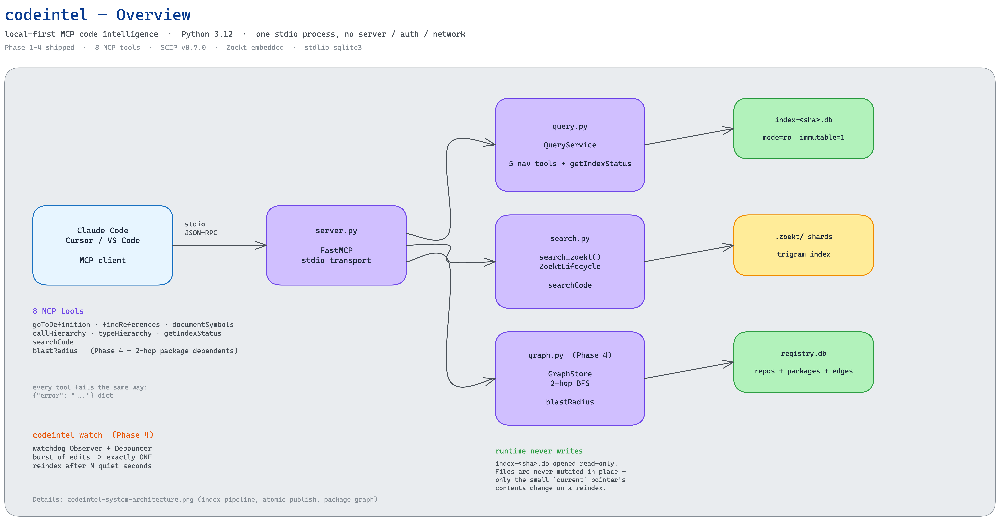
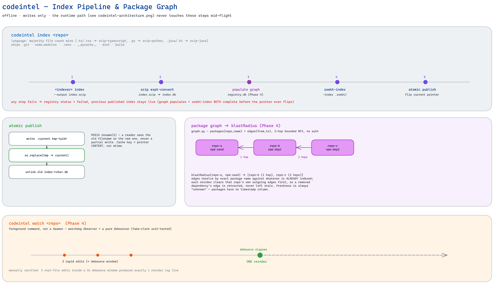

# codeintel

Personal, local-first code intelligence MCP server. SCIP-backed navigation
(go-to-definition, find-references, call/type hierarchy, document symbols) +
Zoekt-backed lexical search, exposed as MCP tools to Claude Code, Cursor, or
any MCP client — over stdio, no server, no auth, no network.

Core query/search logic is ported from `polaris-code-intelligence`; the
enterprise shell (FastAPI, Postgres, Bitbucket auth, Cloud Build) is dropped in
favor of a single stdio process reading local SQLite files.

## Architecture

**Overview** — client, server, the 3 engines (Query / Search / Graph), and storage:



**Index pipeline & package graph** — how `codeintel index` builds and publishes
an index, how the package dependency graph feeds `blastRadius`, and how
`codeintel watch` debounces a burst of edits into one reindex:



Three things worth reading the diagrams for:

- **The runtime path never writes.** Queries open a published `index-<sha>.db`
  read-only (`mode=ro&immutable=1`). Index files are never mutated in place.
- **Publishing is atomic.** A reindex writes a new versioned `.db`, populates
  the package graph, and runs `zoekt-index` — only once *all* of that succeeds
  does `os.replace` (POSIX `rename(2)`) flip the small `current` pointer. A
  query already reading the old file keeps working; there is no downtime
  window, and a failure anywhere leaves the previously published index live.
- **The package graph is rebuilt, not accumulated.** Each reindex clears that
  repo's own outgoing edges before recomputing them, so a removed dependency's
  edge is retracted — `blastRadius` always reflects each repo's *last* index
  run.

Editable sources:
[`docs/assets/codeintel-architecture.excalidraw`](docs/assets/codeintel-architecture.excalidraw) ·
[`docs/assets/codeintel-system-architecture.excalidraw`](docs/assets/codeintel-system-architecture.excalidraw)

## Status

All 4 planned phases shipped. See
[`plans/0724-2316-codeintel-mcp-implementation/plan.md`](plans/0724-2316-codeintel-mcp-implementation/plan.md).

| Phase | Scope | Status |
|-------|-------|--------|
| 1 | Scaffold + vendored SCIP core (`scip_pb2`, `scip_decoder`, `index_reader`) | Done |
| 2 | MCP stdio server + 5 SCIP nav tools + `getIndexStatus` | Done |
| 3 | Indexer CLI, registry, embedded Zoekt + `searchCode` | Done |
| 4 | `blastRadius` (package dependency graph) + `codeintel watch` auto-reindex | Done |

## Install

```bash
uv sync
```

Required on `PATH`:

| Purpose | Binary |
|---------|--------|
| SCIP indexer (pick per language) | `scip-typescript` · `scip-python` · `scip-java` |
| SCIP → SQLite conversion | `scip` (uses `scip expt-convert`) |
| Lexical search | `zoekt-index` · `zoekt-webserver` |

## Indexing a repo

```bash
codeintel index /path/to/your/repo            # slug defaults to the directory name
codeintel index /path/to/your/repo --slug foo # or pick one explicitly
codeintel list
codeintel status foo
codeintel reindex foo
codeintel forget foo
```

**Language detection** counts source files by extension and picks the winner —
one language per index:

| Extensions | Indexer |
|------------|---------|
| `.ts` `.tsx` | `scip-typescript` |
| `.py` | `scip-python` |
| `.java` `.kt` | `scip-java` |

Ties break by fixed priority (`.ts` → `.tsx` → `.py` → `.java` → `.kt`).
`.git`, `node_modules`, `.venv`, `__pycache__`, `dist`, and `build` are
skipped. Rust is **not** supported, and a monorepo gets indexed as whichever
language has the most files — multi-language merge is out of scope.

The pipeline then runs: chosen indexer → `scip expt-convert` → populate the
package dependency graph (`packages`/`edges` tables in `registry.db`) →
`zoekt-index` into `~/.codeintel/.zoekt` → copy to
`~/.codeintel/scip/_/<slug>/_/index-<sha>.db` → atomic `current` pointer flip →
registry update.

> The `scip/_/<slug>/_/` path shape reuses the vendored `IndexConnectionCache`'s
> `(project, repo, branch)` 3-tuple layout with the outer two pinned to `_` (see
> [`src/codeintel/config.py`](src/codeintel/config.py)). It is not a user-facing
> contract — only `<slug>` matters when calling tools.

## Watching a repo (auto-reindex)

```bash
codeintel watch /path/to/your/repo             # debounce defaults to 5s
codeintel watch /path/to/your/repo --debounce 3
```

Runs in the foreground (not a daemon) using `watchdog` — install it with
`uv sync --extra watch`. A burst of file changes (e.g. an editor's atomic
save touching several files) coalesces into exactly **one** reindex, fired
once `--debounce` seconds have passed since the *last* change. `.git`,
`node_modules`, `.venv`, `__pycache__`, `dist`, and `build` are ignored.

## Register with Claude Code

```bash
claude mcp add codeintel --scope user -- uv --directory /path/to/codeintel run codeintel-server
```

## MCP tools

`documentSymbols` · `goToDefinition` · `findReferences` · `callHierarchy` ·
`typeHierarchy` · `getIndexStatus` · `searchCode` · `blastRadius`

Every nav tool takes `repo` (the slug from `codeintel index`) plus a
tool-specific `symbol` or `path`. All tools report failure the same way — a
`{"error": "..."}` payload rather than a transport-level error.

- **`getIndexStatus`** takes an optional `repo_path` (the repo's local git
  working directory) to compare the published commit against
  `git rev-parse HEAD`. Omitted, freshness is reported without a staleness
  check — never `stale: true` without evidence.
- **`searchCode`** takes `query` plus an optional `repo` filter. On first call
  it lazy-spawns an embedded `zoekt-webserver` (pidfile'd so a second codeintel
  process reuses it instead of spawning a duplicate; killed on clean exit via
  `atexit`).
- **`blastRadius`** takes `repo` plus `symbol_or_package` (e.g. `"npm:@scope/
  name"`, the same `"{manager}:{name}"` string `codeintel index` derives from
  each repo's SCIP symbols). Returns every other indexed repo whose package
  depends on it, up to 2 hops, each tagged with its hop distance. The package
  graph has no per-node timestamp, so `freshness` is always `"unknown"` here —
  an honest limitation of the schema, not a bug. Cross-repo edges resolve by
  exact package name against whatever has *already* been indexed: index the
  dependency first, or re-run `codeintel index`/`reindex` after indexing it,
  for an edge to appear. Each reindex retracts that repo's own stale edges
  before recomputing them, so a removed dependency's edge disappears too —
  the graph always reflects each repo's *last* index run, not an
  accumulation of every run it's ever had.

### Known upstream limitations

These are real behaviors of `scip expt-convert` v0.7.0, not codeintel bugs:

- **`typeHierarchy` returns empty** on real-world indexes (TypeScript and
  Python alike) — the converter never populates `global_symbols.relationships`.
- **`displayName` / `kind` are often `null`** for the same reason.
- **`searchCode`'s `repo` filter matches Zoekt's own repository name** — the
  basename of the directory you indexed — which can diverge from codeintel's
  slug if you passed `--slug`. If a scoped search comes back unexpectedly
  empty, retry unscoped to confirm the name.

## Standards

Blob decoding follows the [SCIP protocol](https://scip-code.org/docs.html):
`scip_pb2.py` is generated from `scip.proto` at `sourcegraph/scip` tag
**v0.7.0**, and occurrence/relationship blobs are decoded as real
`scip.Document` / `scip.SymbolInformation` messages.

The SQLite layer (`documents`, `chunks`, `global_symbols`, `mentions`,
`defn_enclosing_ranges`) is **not** part of that published spec — it is the
output shape of the experimental `scip expt-convert` sub-command, verified by
hand against a real index. Treat it as a moving target across `scip` releases.

## Tests

```bash
uv run pytest
```

Integration tests that shell out to the real `scip-python` / `scip` /
`zoekt-index` binaries are marked `integration`:

```bash
uv run pytest -m "not integration"   # unit only
uv run pytest -m integration         # real-binary pipeline
```
