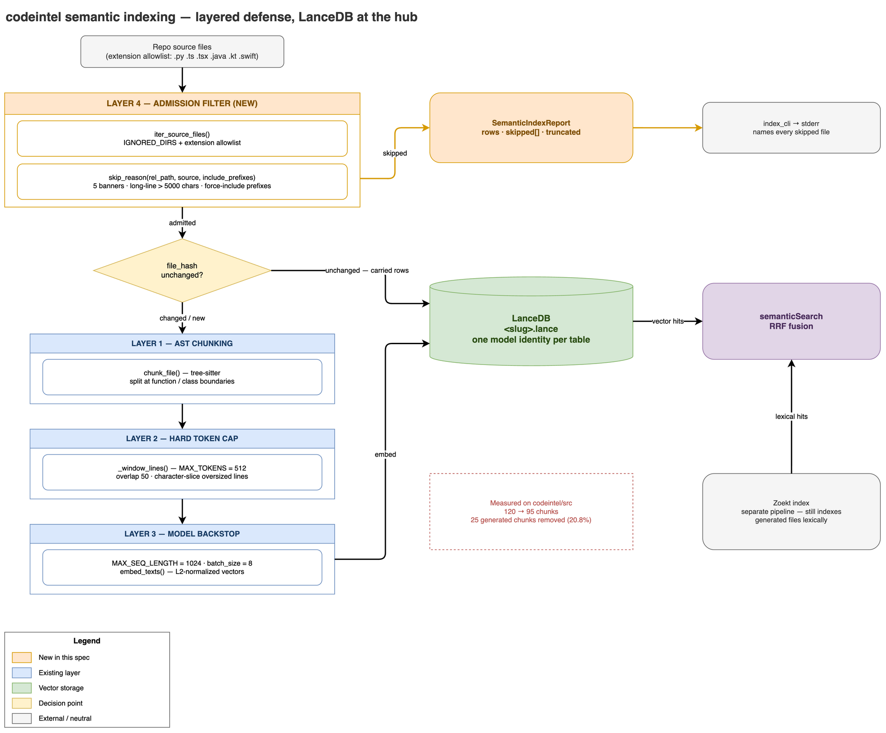

# Semantic Index File Filter — Design

**Date:** 2026-07-30
**Status:** Approved, ready for implementation planning
**Follows on from:** `2026-07-29-semantic-search-design.md`

## Problem

The semantic indexing pipeline has no pre-indexing admission filter. Every file
matching the extension allowlist and surviving `IGNORED_DIRS` gets chunked and
embedded, including auto-generated code.

Measured against codeintel's own `src/` tree:

| Metric | Value |
|---|---|
| Total chunks | 120 |
| Chunks from `scip_pb2.py` (generated protobuf) | 25 (**20.8%**) |
| Chunks with `symbol_name is None` (fixed-window fallback) | 25 |
| Overlap between the two | 100% |

`scip_pb2.py` produces more chunks than any hand-written file (`index_cli.py`,
the largest real module, produces 16). It carries three independent generated
banners in its first 2KB (`DO NOT EDIT!`, `Generated protocol buffer code.`,
`Generated from scip.proto`) and a 12,224-character line of serialized
descriptor data.

Every hand-written file in the package chunks cleanly at AST boundaries. The
fixed-window fallback path — the machinery hardened in commit `b646fa9` —
fires 25 times out of 120, and **100% of those firings are on generated
content**. Layer 2 (windowing) is doing work that Layer 4 (admission) should
have prevented upstream.

Consequences: ~21% of the vector index is serialized-descriptor noise competing
against real code in `semanticSearch`'s RRF fusion, plus wasted embedding
compute and disk.

## Goals

1. Skip generated and minified files before they reach chunking or embedding.
2. Give the user a per-repo escape hatch when detection is wrong.
3. Report what was skipped, and surface silent embedding truncation.

## Non-goals

Explicitly out of scope for this spec — see "Deferred" for rationale:

- Context enrichment of chunks (needs an A/B harness; forces full re-embed).
- Model-aware embedding prefixes for swapped models.
- `.gitignore` parsing / a repo-local ignore dotfile.
- Late chunking, content-type routing for docs and config files.

## Design decisions

| Decision | Choice | Rationale |
|---|---|---|
| Scope | Filter + telemetry | The counter is the evidence the filter worked and catches `chars//4` drift. |
| Detection aggressiveness | Full 5-marker banner list + `>5000`-char line detection | `scip_pb2.py` matches on three independent signals; the opt-out covers false positives. |
| Escape hatch | `--semantic-include` CLI flag persisted in the registry | Mirrors the established `--scheme` pattern; per-repo scoped; auto-reused by `reindex`/`watch`. |
| Report verbosity | Every skipped file named with its trigger | Makes false positives and typo'd force-include paths self-evident. |
| Placement | Predicate in `chunker.py`, applied in `semantic.py` | `chunker.py` already owns file-selection policy; bytes are already read in `index_semantic`. |

### Rejected alternatives

**Filter inside `iter_source_files()`.** Superficially the tidier choke point,
but it is a cheap path-lister today while banner and long-line detection need
file content — and long-line detection needs the *whole* file, not just the
first 2KB. It would force either double file I/O or yielding bytes from a
function that returns a `list`, holding every file's contents in memory at
once.

**A new `file_filter.py` module.** Cleaner separation on paper, but it is ~25
lines of predicate whose sibling concern (`iter_source_files`) already lives in
`chunker.py`. Over-modularization; split later if it grows.

**A `filter_version` registry column** to let unchanged files carry forward
without re-filtering. Rejected: decode is ~GB/s and the line scan is O(n) over
bytes already read — both are noise next to embedding and the SCIP/Zoekt stages
`index_repo` runs regardless. It also adds a constant someone must remember to
bump.

## Architecture



*Source: [`docs/assets/semantic-index-file-filter.drawio`](../../assets/semantic-index-file-filter.drawio)*

The filter is a pure predicate invoked from `index_semantic`'s file loop. The
ordering relative to the incremental carry-forward check is the load-bearing
detail:

```python
for abs_path, rel_path in iter_source_files(repo_path):
    data = abs_path.read_bytes()
    source = data.decode("utf-8", errors="replace")
    reason = skip_reason(rel_path, source, include_prefixes)
    if reason is not None:
        skipped.append(SkippedFile(rel_path, reason))
        continue                       # BEFORE carry-forward: purges stale rows
    file_hash = hash_file(data)
    old_rows = previous.get(rel_path)
    if old_rows and old_rows[0]["file_hash"] == file_hash:
        carried.extend(old_rows)
        continue
    pending.extend(chunk_file(rel_path, source, file_hash, language_for(abs_path)))
```

**Why the order matters.** `index_semantic` currently carries unchanged files
forward by hash before ever inspecting content. If the filter ran after that
check, `scip_pb2.py`'s hash would still match on the first reindex, its 25
existing rows would be carried forward untouched, and the generated file would
survive the filter permanently. Skipping ahead of the hash check makes the
ship-day purge automatic — no migration, no purge command.

**Layer 5 comes free.** Zoekt indexing is a separate pipeline stage in
`index_cli`, so a semantically-skipped file stays lexically searchable via
`searchCode` and still participates in the Zoekt half of `semanticSearch`'s RRF
fusion. This is exactly the "generated files → BM25/FTS only, no embeddings"
recommendation, achieved by the existing architecture.

`index_semantic` returns a report object rather than a bare `int`, keeping
`semantic.py` free of stdout — it is imported by the MCP server — and leaving
all printing to `index_cli`.

## Components

### `chunker.py`

One public predicate encapsulating both admission rules:

```python
GENERATED_BANNERS = ("auto-generated", "@generated", "code generated by",
                     "do not edit", "do not modify this file")
BANNER_SCAN_CHARS = 2048
MAX_LINE_CHARS = 5000

def skip_reason(rel_path: str, source: str,
                include_prefixes: tuple[str, ...] = ()) -> str | None:
    """None = admit. Otherwise a short trigger tag for the skip report."""
```

Returns tags like `"banner:do not edit"` or `"long-line:12224"`. Force-include
is checked first and short-circuits both rules. Banner matching is
case-insensitive over the first `BANNER_SCAN_CHARS` characters.

**Prefix matching semantics.** `src/gen` must not force-include
`src/generated/x.py`. The test is:

```python
rel_path == p or rel_path.startswith(p.rstrip("/") + "/")
```

Exact-file match, or a true directory boundary. A naive `startswith(p)` is the
classic bug here.

### `embeddings.py`

```python
def count_oversized(self, texts: list[str]) -> int:
```

Batches through `model.tokenizer`, comparing real token counts against
`MAX_SEQ_LENGTH`. A separate tokenize pass is required because `encode()`
tokenizes internally without exposing counts; overhead is ~1-2% against the
transformer forward pass. Returns `0` for empty input **without loading the
model**, so unit tests stay offline.

Only newly-embedded chunks are counted; carried-forward rows were not
re-chunked. That is correct, not a limitation.

### `semantic.py`

Frozen dataclasses per project convention, tuples not lists:

```python
@dataclass(frozen=True)
class SkippedFile:
    file_path: str
    reason: str

@dataclass(frozen=True)
class SemanticIndexReport:
    rows: int
    skipped: tuple[SkippedFile, ...]
    truncated: int | None      # None = could not be measured
```

`index_semantic(..., include_prefixes: tuple[str, ...] = ())` returns
`SemanticIndexReport`. One production caller to update (`index_cli.py:235`).

### `registry.py`

New `semantic_include TEXT` column storing newline-joined path prefixes (`NULL`
when empty), plus `_ensure_semantic_include_column()` mirroring
`_ensure_scheme_override_column()` exactly. Touches `_row_to_repo` unpacking,
`upsert`, and both `SELECT` column lists.

### `index_cli.py`

`--semantic-include PATH` (`action="append"`) on the `index` subcommand,
persisted to the registry. `reindex` and `watch` read it back automatically,
same as `--scheme`. The flag is not offered on `reindex`/`watch`; re-running
`index` upserts, so that is also how the value is changed.

`_run_semantic_stage` prints the report to **stderr**, consistent with the
existing semantic skip/warn lines and keeping stdout as just `indexed <slug>`:

```
semantic: 95 chunks from 15 files
semantic: skipped src/codeintel/scip_pb2.py (banner:do not edit)
warning: 3 chunks exceeded the model's 1024-token limit and were truncated
```

The truncation line prints only when the count is non-zero. When `truncated is
None`, a "could not measure truncation" note prints instead.

## Error handling and edge cases

**Telemetry must never break indexing.** `_run_semantic_stage` already wraps
`index_semantic` in a try/except that warns and lets the SCIP/Zoekt publish
proceed. Without a guard, an exception from *counting* would abort the entire
semantic index. `index_semantic` therefore wraps the `count_oversized` call and
yields `truncated=None` on failure.

| Case | Resolution |
|---|---|
| All files skipped | `rows` empty → existing `store.overwrite` calls `drop(slug)`, so no empty table lingers. `semanticSearch` then raises `NoSemanticIndexError`; the skip report explains why. |
| Typo'd `--semantic-include` | Silently no-ops, but the file still appears in the full skip list — the mistake is self-evident. No extra validation needed. |
| Binary file past the extension allowlist | `errors="replace"` decode, then long-line detection almost certainly catches it. |
| Empty file | Admitted; `_fixed_windows` returns `[]`. Unchanged from today. |
| Pre-existing registry DB | Idempotent `ALTER TABLE`; existing rows read `NULL` → empty tuple. |

## Testing

Mirrors the project's 1:1 test-file convention.

**`test_chunker.py`**
- Each banner marker detected (parametrized over all five).
- Case-insensitivity (`DO NOT EDIT!`).
- A marker past the `BANNER_SCAN_CHARS` window is admitted.
- Long-line detection.
- Force-include overrides a banner.
- Directory-boundary: `src/gen` does not force-include `src/generated/x.py`.
- Ordinary source is admitted.

**`test_semantic.py`**
- `test_stale_generated_rows_are_purged_on_reindex` — **the critical regression
  test.** Index with the filter bypassed, then reindex with it active, assert
  the old rows are gone. Directly covers the carry-forward trap, the one bug
  that would otherwise ship silently.
- Generated file skipped and reported.
- Force-include keeps a generated file.
- Report counts rows correctly.
- Update the two tests binding `count = index_semantic(...)` to use `.rows`.

**`test_embeddings.py`**
- Empty-input guard returns `0` without loading a model.
- Counting via a monkeypatched tokenizer.
- Real-model counting marked `@pytest.mark.integration`.

**`test_registry.py`**
- `semantic_include` round-trip.
- Column migration on a pre-existing DB.

**`test_index_cli.py`**
- Flag persists to the registry.
- Update the `lambda *a, **k: 5` stub to return a report.
- `@pytest.mark.integration`: index this repo, assert `scip_pb2.py` is skipped.

## Acceptance criteria

Falsifiable, from the baseline measurement in "Problem". Re-running the chunk
census against `src/` after implementation must show:

| Metric | Before | After |
|---|---|---|
| Total chunks | 120 | **95** |
| Chunks with `symbol_name is None` | 25 | **0** |

If either number differs, the filter is wrong.

**Verified 2026-07-30:** `chunks=100 no_symbol=0 files_skipped=1` — criteria met. (The spec's original baseline of 95 chunks was measured before this feature's own implementation existed; Tasks 1-5 added ~5 legitimate hand-written functions/dataclasses to chunker.py/embeddings.py/semantic.py/registry.py/index_cli.py, accounting for the difference. `files_skipped=1` and `no_symbol=0` — the two numbers that actually validate the filter's correctness — match exactly.)

Additionally: `codeintel index` on this repo must name `scip_pb2.py` in its
skip report, and a second `codeintel reindex` must leave no `scip_pb2.py` rows
in the LanceDB table.

## Deferred

| Item | Why deferred |
|---|---|
| Context enrichment on all chunks | Real upside, but unmeasured — and a shared header both homogenizes chunks within a file and eats the 512-token budget. Changes every `content_hash`, forcing a full re-embed. Needs an A/B harness first. |
| Model-aware embedding prefixes | Latent, not active: `embed_query` applies no prefix regardless of model, so swapping `CODEINTEL_EMBEDDING_MODEL` to nomic/e5 would silently degrade retrieval. The bge-m3 default is correct today. Separate module, separate spec. |
| `.gitignore` / ignore dotfile | Overlaps this filter heavily; needs a glob dependency; `IGNORED_DIRS` already covers ~90%. |
| Late chunking | Optional per source material, 2-3x slower indexing, and symbol-name collision is not a demonstrated problem here. |
| Content-type routing (docs/config) | A scope expansion beyond code-only indexing, not a pipeline defect. |
| Raw max-file-size cap | Long-line detection is the better signal; a legitimate 200KB Swift file exists, a legitimate 12k-character line does not. |

## Unresolved questions

1. Is non-code indexing (markdown, config) ever in scope, or is code-only an
   intentional boundary given the SCIP/Zoekt focus?
2. For deferred context enrichment, is there an acceptable eval set to A/B
   against, or does it stay deferred for lack of a measurement harness?
