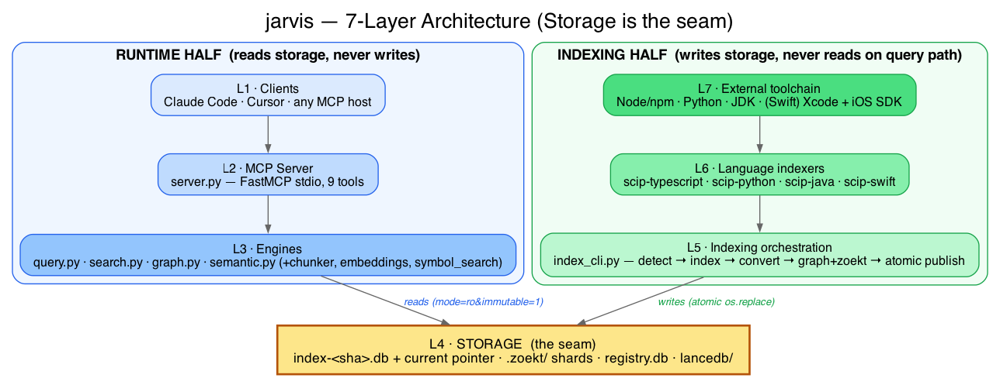
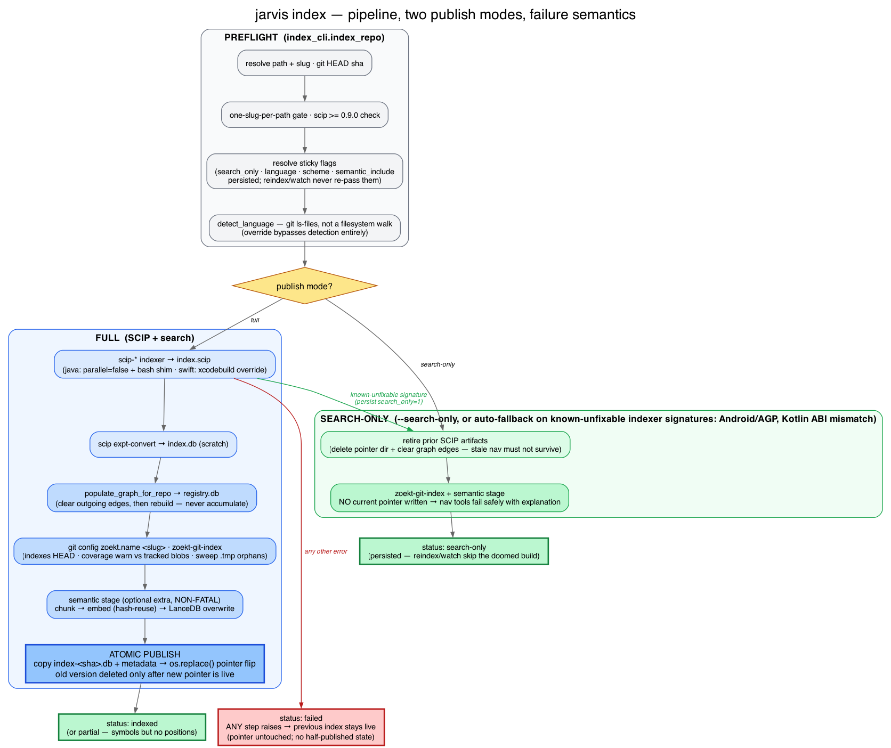
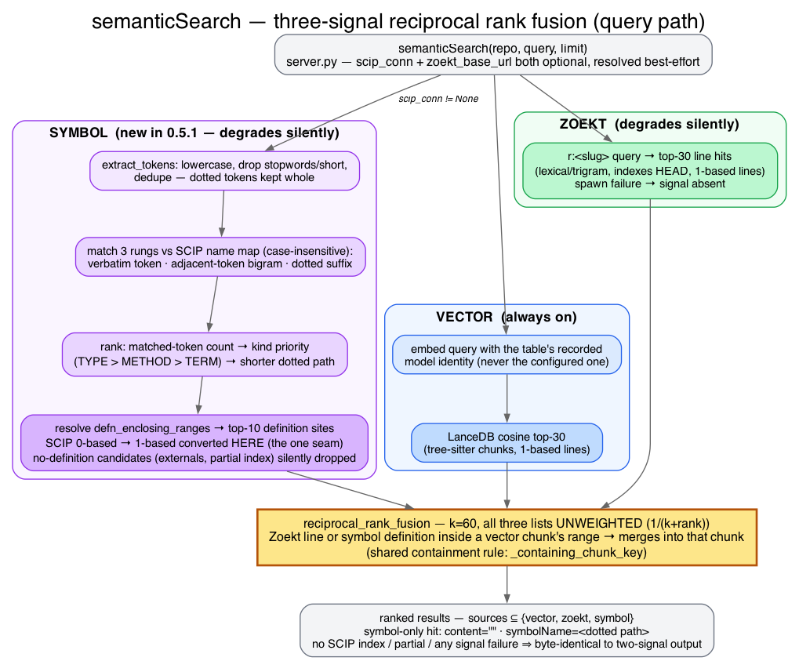

# jarvis: System Architecture

## High-Level Overview

jarvis is a **local-first, single-user code intelligence MCP server** that combines structural navigation (SCIP-backed) with lexical search (Zoekt-backed) and natural-language semantic/vector search in a single stdio process. It bridges the SCIP indexing ecosystem with the MCP protocol, exposing 9 tools to Claude Code, Cursor, and other MCP clients: `documentSymbols`, `goToDefinition`, `findReferences`, `callHierarchy`, `typeHierarchy`, `getIndexStatus`, `searchCode`, `semanticSearch`, `blastRadius`.

The system is built around four core engines:

1. **Query Engine** — reads SCIP SQLite indexes, executes nav queries (go-to-definition, find-references, etc.)
2. **Search Engine** — manages embedded Zoekt instance, returns lexical search results
3. **Graph Engine** — builds and queries package dependency relationships across indexed repos
4. **Semantic Engine** — tree-sitter chunking + self-hosted embeddings into a per-repo LanceDB table, fused with Zoekt hits for natural-language `semanticSearch`

### Layered Architecture (primary view)



*Editable source: [`assets/jarvis-layers.dot`](assets/jarvis-layers.dot) (Graphviz) — also exported as
`assets/jarvis-layers.svg`. Regenerate with
`dot -Tpng -o docs/assets/jarvis-layers.png docs/assets/jarvis-layers.dot`.*

Seven layers, top to bottom. **Storage (layer 4) is the seam**: the runtime only ever reads
down into it, the indexing pipeline only ever writes up into it, and the two halves share no
other contract.

| Layer | Contents |
|---|---|
| 1 · Clients | Claude Code, Cursor, any MCP host |
| 2 · MCP Server | `server.py` — FastMCP over stdio, 9 tools |
| 3 · Engines | Query (`query.py`), Search (`search.py`), Graph (`graph.py`), Semantic (`semantic.py`, `chunker.py`, `embeddings.py`, `symbol_search.py`) |
| 4 · Storage | `index-<sha>.db` + pointer, `.zoekt/` shards, `registry.db`, `~/.jarvis/lancedb/` |
| 5 · Indexing orchestration | `index_cli.py` — detect → run indexer → convert → graph/zoekt → atomic publish |
| 6 · Language indexers | `scip-typescript`, `scip-python`, `scip-java`, `scip-swift` |
| 7 · External toolchain | Node/npm, Python, JDK, and (Swift only) Xcode + iOS SDK |

Layer 6→7 is where Swift differs from every other language: the other three indexers need only
an ordinary runtime, while `scip-swift` needs Xcode and the iOS SDK, which Apple ships for macOS
only.

### Runtime Detail

Expanding layers 1–4 of the table above, the runtime path is:

- **Client**: Claude Code / Cursor / any MCP client → MCP stdio
- **Server** (`server.py`): FastMCP dispatcher → 9 tools
- **Query Engine** (`query.py`): Reads SCIP index SQLite (documents/chunks/global_symbols)
- **Search Engine** (`search.py`): HTTP client to embedded Zoekt webserver
- **Graph Engine** (`graph.py`): Queries package edges in registry.db
- **Semantic Engine** (`chunker.py` + `embeddings.py` + `semantic.py`): tree-sitter chunking → embeddings → per-repo LanceDB table, fused with Zoekt hits
- **Storage**: SCIP indexes (index-<sha>.db), Zoekt shards (.zoekt/), registry (registry.db), LanceDB tables (~/.jarvis/lancedb/)

---

## Indexing Pipeline & Publishing

The full indexing lifecycle, from file changes → published index (layers 5–7 of the table above,
writing up into the storage seam):



*Editable source: [`assets/jarvis-index-pipeline.dot`](assets/jarvis-index-pipeline.dot) (Graphviz).
Regenerate with `dot -Tpng -o docs/assets/jarvis-index-pipeline.png docs/assets/jarvis-index-pipeline.dot`.*

### The Pipeline (index_cli.py)

1. **Language Detection**
   - Count extensions across `git ls-files` (`_git_tracked_files()`), not a filesystem walk — a
     walk also counts gitignored vendored checkouts, sibling clones, and worktrees, which can
     outnumber the repo's own code and pick a language it doesn't use
   - Select language with most files (tie-break by priority: .ts → .tsx → .py → .java → .kt → .swift)
   - Skip: .git, node_modules, .venv, __pycache__, dist, build, DerivedData, .build (`_IGNORED_DIRS`
     still applies on top, since git does not exclude build output a repo happens to commit)
   - A non-git `repo_path` raises `NotAGitRepositoryError` before detection runs
   - `--language <name>` bypasses detection entirely and persists to the registry
     (`language_override` column, `_resolve_language()`) so `reindex`/`watch` reuse it automatically

2. **Run Language Indexer**
   - Execute `scip-typescript`, `scip-python`, `scip-java`, or `scip-swift` on repo root
   - Output: raw SCIP document (protobuf, optionally zstd-compressed)
   - **Swift build-tool selection:** For Swift repos with a checked-in `.xcodeproj` or `.xcworkspace` (but no `Package.swift`-only setup), use `scip-swift --build-tool xcodebuild` instead of the default SwiftPM backend. Rationale: `scip-swift`'s own `BuildBackendDetector` picks SwiftPM whenever `Package.swift` exists, even for UIKit-only iOS packages with no macOS platform support, where plain `swift build` fails. This override forces xcodebuild for such repos. When a scheme is specified (via `--scheme` flag or persisted in registry), append it to the indexer command.

3. **SCIP Conversion**
   - Run `scip expt-convert` to convert SCIP document → SQLite
   - Creates `documents`, `chunks`, `global_symbols`, `mentions`, `defn_enclosing_ranges` tables
   - Contains occurrence metadata and symbol information

4. **Package Graph Population**
   - Extract package names from all symbols (e.g., "npm:@scope/name", "python:requests")
   - Build edges in registry.db: source_repo → dependent_package
   - Uses rebuild-not-accumulate (delete old edges for this repo, insert new ones)

5. **Lexical Indexing**
   - Run `zoekt-index` against the same repo
   - Creates Zoekt shards in `.zoekt/` directory
   - Files are searchable by keyword, filename, content

6. **Automatic Search-Only Fallback (on recognized indexer failures)**
   - If the language indexer stderr/stdout matches a recognized signature (Kotlin version mismatch, Android/AGP no-shards), `_search_only_reason()` returns a human-readable reason
   - On detection, publishes Zoekt + semantic search only via `_publish_search_only()` instead of hard-failing; persists `search-only` status to registry
   - Explicit `--search-only` flag enables this code path upfront, skipping SCIP indexing entirely
   - Any unrecognized indexer failure is still a hard failure

7. **Semantic Indexing (non-fatal, `_run_semantic_stage()`)**
   - Chunk source files (`chunker.py`), embed chunks (`embeddings.py`), write to a per-repo
     LanceDB table (`semantic.index_semantic()`)
   - Skips cleanly if the `semantic` extra isn't installed (`SemanticExtraMissingError`); any
     other failure is caught and logged — neither case blocks the SCIP/Zoekt publish
   - On success, `Registry.mark_semantic_indexed()` records `semantic_indexed_at`

8. **Atomic Publishing**
   - Copy SCIP index to final location: `~/.jarvis/scip/_/<slug>/_/index-<sha>.db`
   - Update `current` pointer file (small text file, atomic `os.replace()`)
   - Update registry.db: mark repo as indexed, record commit SHA, timestamp

### The Watch Loop (jarvis watch)

Runs in foreground using `watchdog` library:

1. **File Monitor**
   - Observe filesystem changes in repo directory
   - Skip ignored paths (.git, node_modules, .venv, __pycache__, dist, build)

2. **Debounce**
   - Buffer file change events
   - Wait `--debounce` seconds (default 5s) since *last* change
   - Coalesce burst of file edits into single reindex trigger

   *Note: `watch.py`'s `should_ignore_path` uses its own ignore set, which does not
   include the `DerivedData` / `.build` entries added to `detect_language()`'s
   `_IGNORED_DIRS`. On an Xcode-project repo, build-artifact churn can therefore
   still trigger a debounce cycle.*

3. **Reindex**
   - Once debounce window closes, run the full indexing pipeline above
   - Atomically publish, zero query downtime

---

## Three Architectural Guarantees

### 1. Read-Only Runtime (Zero Writes During Queries)

**The guarantee:** Query operations open published indexes read-only with immutability flags. The runtime never mutates index files.

**Implementation:**
```python
# index_reader.py (vendored from SCIP source)
conn = sqlite3.connect(f"file:{path}?mode=ro&immutable=1", uri=True)
```

**Why it matters:**
- Queries are safe concurrent operations; multiple readers can coexist
- No lock contention during index publish
- Safe on NFS and shared filesystems (immutable flag ensures WAL safety)

---

### 2. Atomic Publishing (Zero Downtime Reindex)

**The guarantee:** Publishing is atomic at the pointer boundary. A reindex writes a new versioned `.db`, populates the graph, and runs `zoekt-index` — only once *all* succeed does the pointer flip via `os.replace()`. A query already reading the old file keeps working; no partial-state window.

**Implementation:**
```python
# index_cli.py: Publish flow
new_db_path = index_dir / f"index-{commit_sha}.db"

# Expensive operations (can fail, no risk to old index)
populate_graph_for_repo(repo_slug, symbols)
zoekt_index(repo_path, output=new_db_path)

# Only once all succeed, atomically swap
current_pointer = index_dir / "current"
os.replace(new_db_path, current_pointer)  # POSIX atomic rename(2)
```

**Why it matters:**
- Zero query downtime across reindex
- If anything fails (graph population, Zoekt indexing), old index stays live
- No "half-indexed" state visible to queries
- Clients never see "index not found" mid-query

---

### 3. Rebuild-Not-Accumulate Graph (Always Current)

**The guarantee:** Each reindex clears that repo's own outgoing edges before recomputing them. Removed dependencies are retracted. The graph always reflects each repo's *last* index run, not an accumulation.

**Implementation:**
```python
# graph.py: Populate for repo
def populate_graph_for_repo(repo_slug: str, symbols: list[str]):
    # DELETE old edges for this repo first
    db.execute("DELETE FROM edges WHERE source_repo = ?", (repo_slug,))
    
    # Then INSERT new edges
    for pkg in extract_package_names(symbols):
        db.execute("INSERT INTO edges ...", (repo_slug, pkg, ...))
```

**Why it matters:**
- `blastRadius` results are never stale (don't reference deleted dependencies)
- No accumulation bugs from partial re-runs or tool restarts
- Graph is always consistent with the current index

---

## Query Path (Runtime)

When a Claude Code user calls a tool like `goToDefinition`:

1. **MCP Client** sends: `{"repo": "myrepo", "path": "src/main.ts", "line": 10, "character": 5}`

2. **server.py (MCP dispatcher)**
   - Unpacks args
   - Calls `QueryService.go_to_definition(...)`
   - Catches all exceptions → `{"error": "..."}`

3. **query.py (Query Engine)**
   - Looks up repo in registry.db (validate it exists, get commit SHA)
   - Opens `index-<sha>.db` read-only via `IndexConnectionCache`
   - Executes SQL query against documents/chunks/global_symbols tables
   - Builds result dataclass (Location, SymbolInfo, etc.)

4. **server.py (Response)**
   - Converts result dataclass to dict via `dataclasses.asdict()`
   - Returns `{"location": {...}, "symbol": {...}}` to MCP client

5. **MCP Client** (Claude Code)
   - Receives JSON response
   - Displays nav result to user (file, line, column, symbol)

---

## Search Path (Runtime)

When a user calls `searchCode`:

1. **First call only:** `ZoektLifecycle.ensure_running()` spawns `zoekt-webserver -rpc` in background
   - Pidfile: `~/.jarvis/.zoekt/zoekt.pid`
   - Listens on port (discovered from Zoekt binary)
   - Indexes already on disk in `.zoekt/` are auto-loaded

2. **HTTP Request** (search.py)
   - POST to `http://localhost:PORT/api/search`
   - JSON body: `{"q": "query string", "repos": ["repo1", "repo2"] (optional)}`

3. **HTTP Response**
   - Zoekt returns matched files + line fragments
   - Parse JSON, wrap in result types

4. **Response to MCP client**
   - Return list of matches with file path, line number, content snippet

**Lifecycle:**
- Server keeps running for subsequent `searchCode` calls (fast)
- On `jarvis-server` exit, `atexit` handler kills `zoekt-webserver`

---

## Graph Path (Runtime)

When a user calls `blastRadius(repo, symbol_or_package)`:

1. **Input Validation**
   - Validate repo is indexed in registry.db

2. **Package Name Resolution**
   - If input is a symbol (e.g., "python:requests"), extract package name
   - If already a package name, use as-is

3. **BFS (2-hop bounded)**
   - Query registry.db edges table
   - Find all repos whose packages depend on this package
   - Limit to 2 hops (direct + transitive)
   - Track hop distance for each dependent

4. **Result Building**
   - For each dependent repo, fetch metadata from registry.db
   - Build result with repo slug, hop distance, package name

5. **Response to MCP client**
   - Return `[{repo: "...", symbol_or_package: "...", distance: 1}, ...]`

---

## Semantic Path (Runtime)

When a user calls `semanticSearch(repo, query, limit=10)`:



*Editable source: [`assets/jarvis-semantic-fusion.dot`](assets/jarvis-semantic-fusion.dot) (Graphviz).
Regenerate with `dot -Tpng -o docs/assets/jarvis-semantic-fusion.png docs/assets/jarvis-semantic-fusion.dot`.*

1. **Admission (indexing time, `chunker.py`)**
   - `iter_source_files()` walks the repo, then drops anything `.gitignore` matches (via one
     batched `git check-ignore --stdin` call, `gitignored()`) — a subprocess failure degrades to
     "nothing ignored" rather than disabling filtering repo-wide
   - `oversized_file_reason()` rejects any file over 1 MB (`MAX_FILE_BYTES`), checked from `stat()`
     before the file is ever read into memory — a backstop for large-but-not-generated content that
     the banner/long-line generated-file filter (see roadmap) wouldn't otherwise catch
   - `--semantic-include <prefix>` is a single escape hatch across all three admission checks
     (generated-file banner, gitignore, size cap) — a force-included path is always admitted

2. **Chunking (indexing time, `chunker.py`)**
   - Parse each source file with tree-sitter, splitting at function/class boundaries
     (256-512 token target, reserving `HEADER_RESERVE_TOKENS` headroom for the header added below);
     an unparseable language falls back to fixed-window chunks
   - As a final pass, every chunk gets a `# file: <path>` context header (plus `# in class: <Name>`
     when the chunk is a method split out of an oversized class) — this re-adds context that the
     chunk's own text lost when it was split from its surrounding file
   - Each chunk carries a content hash (over the header + code, so a header change invalidates the
     hash) for dedup and the file hash for change detection
   - `chunk_file()` reports p50/p90/max token-size percentiles (`TokenStats`) over the batch, for
     CLI visibility into how close chunks are running to `MAX_TOKENS`

3. **Embedding (indexing time, `embeddings.py`)**
   - Lazy-loaded `EmbeddingModel` (default `BAAI/bge-m3`, 1024-dim, pinned revision) embeds
     changed chunks; unchanged files carry over their existing vectors by file hash
   - A model-aware query/document instruction prefix is applied before encoding — auto-detected by
     substring match against `MODEL_PREFIXES` (bge-m3, e5, nomic-embed), overridable via
     `JARVIS_EMBEDDING_QUERY_PREFIX`/`JARVIS_EMBEDDING_DOC_PREFIX`. An unlisted model with no
     override surfaces a `prefix_warning()` instead of silently applying no prefix
   - Vectors are L2-normalized for cosine search

4. **Storage (`semantic.py`: `SemanticStore`)**
   - One LanceDB table per repo under `~/.jarvis/lancedb/`, atomically overwritten per index run
   - The table records a full `TableIdentity` used to build it (`table_identity()`): model name,
     model revision, query prefix, doc prefix, and `CONTENT_FORMAT` (chunker.py's version of the
     stored chunk-text shape) — a table is only reused as a carry-forward source when every field
     matches

5. **Query (`semantic.py`: `semantic_search()`)**
   - Embeds the query using the full identity stored in the table (model, revision, *and*
     prefixes — never whatever's currently configured) and runs a cosine-metric vector search
   - `symbol_search.search_symbols()` matches query tokens against the SCIP name map (when a
     SCIP index exists) and resolves ranked candidates to definition locations — the third signal
   - Fuses vector hits, `searchCode`'s Zoekt lexical hits, and the symbol-definition hits via
     `reciprocal_rank_fusion()` (k=60, all signals unweighted); each signal degrades silently
     when unavailable — no SCIP index or a Zoekt spawn failure never errors the search

6. **Response to MCP client**
   - Returns ranked hits; includes a `"warning"` field if the table's recorded identity differs
     from the currently configured one, nudging a reindex

**Key invariant:** a LanceDB table only ever holds vectors from one `TableIdentity` at a time —
model, revision, prefixes, and content format together. If any part changes, old vectors are never
reused — every chunk is fully re-embedded on the next `jarvis index`/`reindex`. This is what
prevents silently mixing incompatible embedding spaces or wrong-prefix/wrong-header text.

---

## Storage Layout

```
~/.jarvis/                          # Default data dir (override via JARVIS_DATA_DIR)
├── registry.db                        # Master registry: repos table + packages + edges
├── scip/
│   └── _/
│       └── <slug>/
│           └── _/
│               ├── current            # Pointer file (text, content: commit SHA or db name)
│               ├── index-<sha1>.db    # SCIP SQLite (documents, chunks, global_symbols, ...)
│               └── index-<sha2>.db    # (old versions, kept for GC later)
├── .zoekt/
│   ├── zoekt.pid                      # Pidfile (zoekt-webserver PID)
│   └── <shards>                       # Zoekt index shards (repo-specific)
└── lancedb/
    └── <slug>                         # One LanceDB table per repo (semantic search vectors)
```

**registry.db schema:**
- `repos(slug TEXT PRIMARY KEY, path TEXT, language TEXT, commit_sha TEXT, last_indexed TIMESTAMP, status TEXT, scheme_override TEXT, semantic_indexed_at TEXT, semantic_include TEXT, language_override TEXT)`
- `packages(id, repo_slug, package_name)`
- `edges(source_repo TEXT, target_package TEXT, ...)`

**index-<sha>.db schema** (from `scip expt-convert`):
- `documents(document_id, path, text, relative_url, language)`
- `chunks(chunk_id, document_id, range_start_line, range_start_char, range_end_line, range_end_char)`
- `global_symbols(symbol_id, symbol, kind, display_name, ...)`
- `mentions(symbol_id, range_id, is_definition, is_type_definition, is_reference, ...)`
- `defn_enclosing_ranges(definition_id, enclosing_range_id, ...)`

---

## Concurrency & Thread Safety

### IndexConnectionCache (Thread-Safe)

The vendored `IndexConnectionCache` maintains a bounded pool of SQLite connections per unique (project, repo, branch, pointer_content) tuple.

- **Thread-safe:** Uses locks internally
- **Size-bounded:** Garbage collects stale connections
- **NFS-safe:** Detects pointer file changes and invalidates caches

### MCP Server (Single-Threaded)

The FastMCP server is single-threaded:
- No concurrent query handling
- No locking needed for static tables (registry.db)
- All database access is read-only (except during indexing)

### Indexing (Exclusive)

Indexing is exclusive — only one reindex can run at a time per slug (enforced by watching process or user discipline).

---

## Dependencies & External Tools

### Runtime Dependencies (Python)

- **mcp[cli]** — FastMCP framework
- **protobuf** — SCIP document decoding
- **zstandard** — SCIP blob decompression
- **httpx** — Zoekt webserver HTTP client
- **watchdog** (optional, `--extra watch`) — filesystem monitor for `jarvis watch`
- **lancedb**, **sentence-transformers**, **tree-sitter**, **tree-sitter-language-pack**
  (optional, `--extra semantic`) — chunking, embedding, and vector storage for `semanticSearch`.
  Every import of these is deferred inside functions, never at module top-level, so a base
  install (without the extra) is completely unaffected.

### External Binaries (Must be on PATH)

- **Language indexers** (pick one or more):
  - `scip-typescript` — TypeScript/JavaScript indexing
  - `scip-python` — Python indexing
  - `scip-java` — Java/Kotlin indexing. **Known limitations:** Android/AGP projects produce zero SCIP shards because scip-java's Gradle plugin relies on standard source sets that AGP replaces with variants (upstream scip-java#177); Kotlin versions other than the pinned release fail with AbstractMethodError or NoSuchMethodError because scip-kotlinc is compiled against exactly one Kotlin version and the compiler-plugin API is internal/unstable. Both trigger automatic fallback to `--search-only` (lexical search + semantic search only).
  - `scip-swift` — Swift indexing ([phuongddx/scip-swift](https://github.com/phuongddx/scip-swift)).
    Exists, builds, and runs end-to-end via `jarvis index` without error, populating the
    symbol table. Requires a macOS host (Xcode + iOS SDK) for any repo importing Apple-platform frameworks.
- **SCIP converter:**
  - `scip` (uses `scip expt-convert` subcommand)
- **Search indexer & server:**
  - `zoekt-index` — Zoekt indexing
  - `zoekt-webserver` — Embedded search server

---

## Failure Modes & Recovery

### Index Publish Fails (New Index Incomplete)

**What happens:** Indexing pipeline fails partway through (language indexer crashes, zoekt-index fails, etc.)

**Recovery:** Old index stays live. User can retry `jarvis reindex` once the issue is fixed.

### Query Against Missing Index

**What happens:** `repo` argument refers to an unindexed repo.

**Recovery:** `{"error": "Repo not indexed"}` returned to MCP client.

### Zoekt Webserver Dies

**What happens:** Embedded zoekt-webserver crashes mid-session.

**Recovery:** Next `searchCode` call triggers `ZoektLifecycle.ensure_running()` and respawns it. First call may be slow; subsequent calls are fast.

### Registry.db Corruption

**What happens:** Manual corruption or concurrent writes to registry.db.

**Recovery:** Manual backup restore or re-run `jarvis index` for all repos to rebuild registry.

---

## Known Limitations (Upstream)

These are real behaviors of SCIP/Zoekt, not jarvis bugs:

- **typeHierarchy returns empty:** SCIP v0.9.0 converter never populates `global_symbols.relationships`. Upstream issue: [scip-code/scip#464](https://github.com/scip-code/scip/issues/464), fixed by [PR #465](https://github.com/scip-code/scip/pull/465).
- **displayName / kind often null:** Same cause as above.
- **Zoekt repo filter matches directory name:** The basename of the directory you indexed, which can diverge from jarvis's `--slug` if passed. Unscoped searches are more reliable.
- **Package graph freshness always "unknown":** Graph has no per-node timestamp; only repo-level freshness (commit SHA) is tracked.

---

## Future Extensibility

### Adding a New Language Indexer

1. Create a new SCIP indexer (e.g., `scip-go` for Go)
2. Add to language detection in `index_cli.py` (`_LANGUAGE_INDEXERS` + `_EXT_PRIORITY`) — this also
   extends `_INDEXER_BY_LANGUAGE`, the derived reverse map that validates `--language` values, so
   the two cannot drift
3. Test end-to-end (index repo → query nav tools)

Swift is the worked example of this path — the jarvis-side entry landed in one table,
but the indexer itself was the real work.

### Adding a New Query Tool

1. Implement query logic in `query.py`
2. Add MCP tool in `server.py` with error handling
3. Add tests in `test_server_tools.py` and `test_query.py`

### Upgrading SCIP Version

1. Regenerate `scip_pb2.py` from new `scip.proto`
2. Update version pin in README
3. Test with real indexes from new version
4. Adapt query logic if schema changes (comments in code help)

### Distributed / Multi-User (Phase 5+)

Would require:
- Multi-tenant schema (separate indexes per user/project)
- Auth layer (not MCP stdio, likely HTTP API)
- Centralized registry (shared database)
- Query caching / performance optimization
- Currently out of scope.
